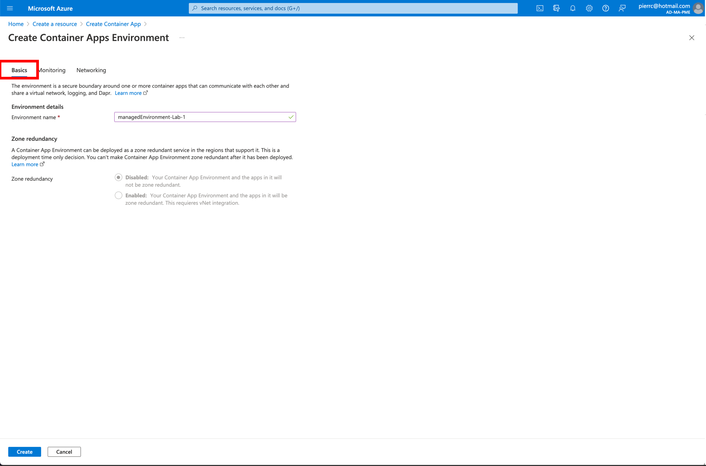
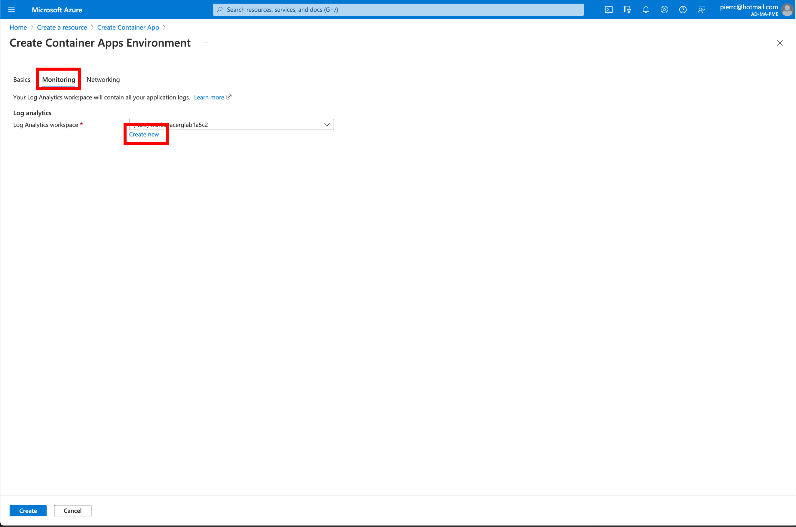
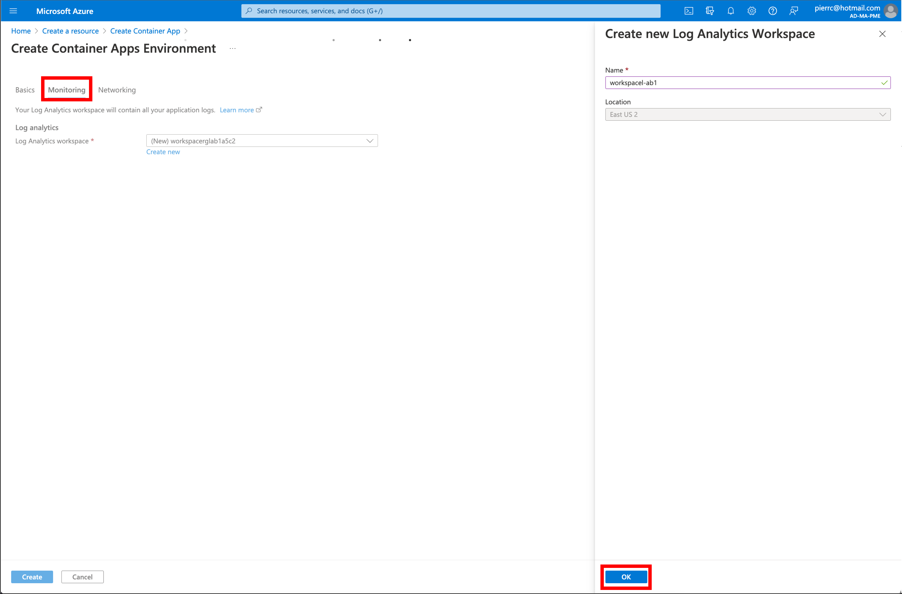
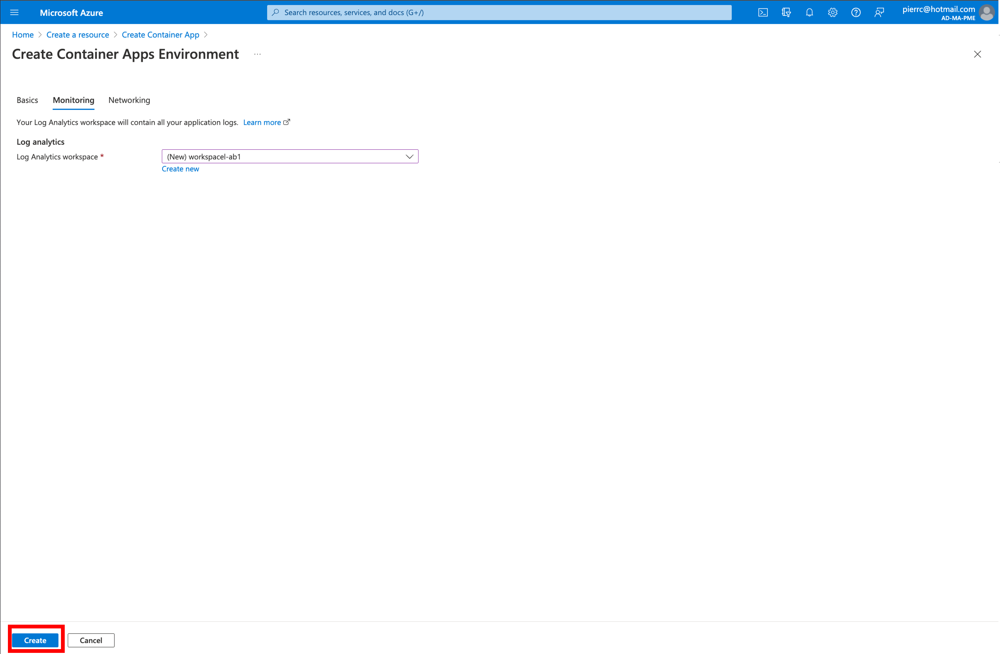
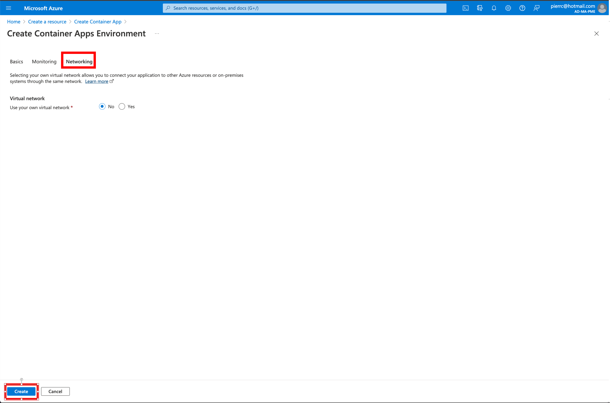
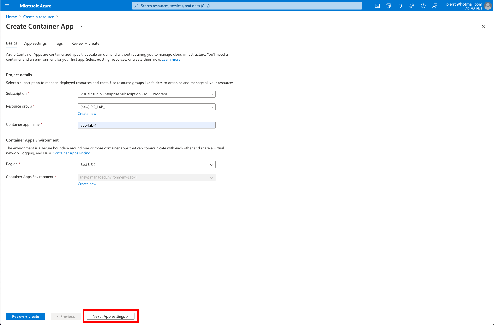
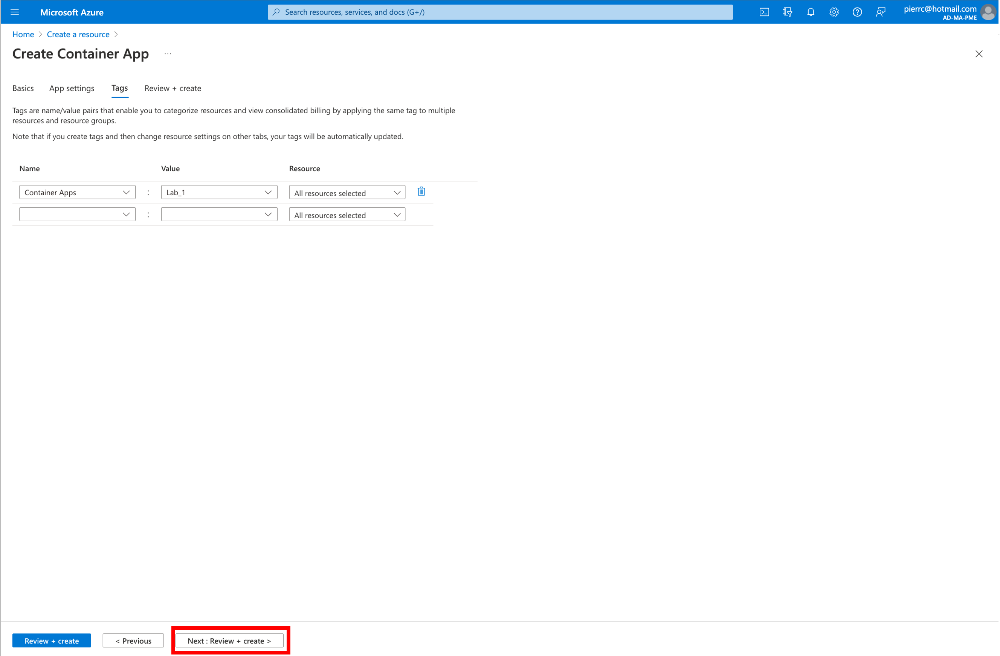
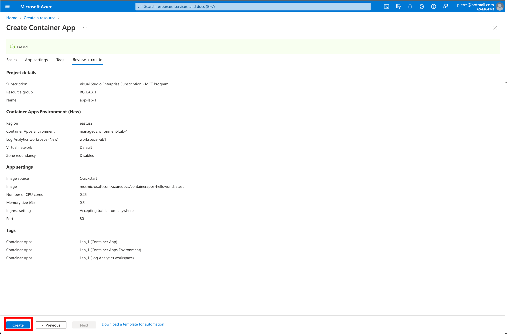

# Lab_1: Déploiement d’une infrastructure Azure Container Apps à l'aide de la console Azure

## Objectif:
L'objectif de ce Lab 1, c'est de déployer une Container Apps simple et de faire un tour d'horizon de la console "Azure Container Apps"

## Création de la ressource "Azure Container Apps" 
Dans la console Azure: 
 
 
https://docs.microsoft.com/en-us/azure/container-apps/environment 
 
 
 
 
 
https://docs.microsoft.com/en-us/azure/container-apps/networking 
 
 
 
 
