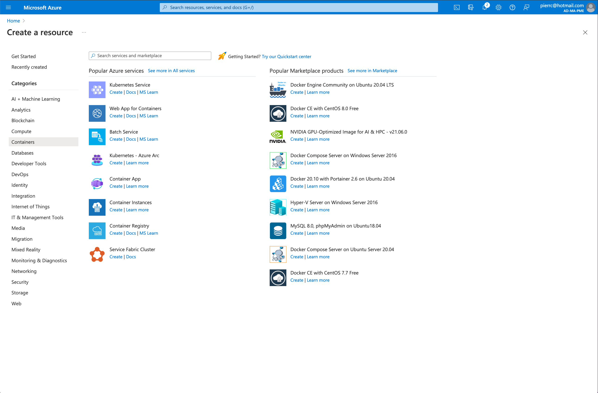
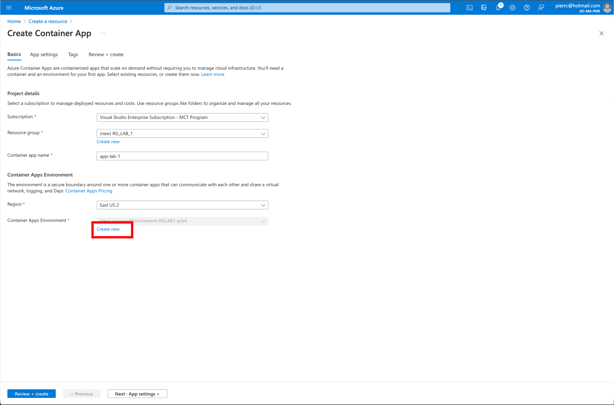

# Lab_1: Déploiement d’une infrastructure Azure Container Apps à l'aide de la console Azure

## Objectif:
L'objectif de ce Lab 1, c'est de déployer une Container Apps simple et de faire un tour d'horizon de la console "Azure Container Apps"

## Création de la ressource "Azure Container Apps" 
Dans la console Azure: 

