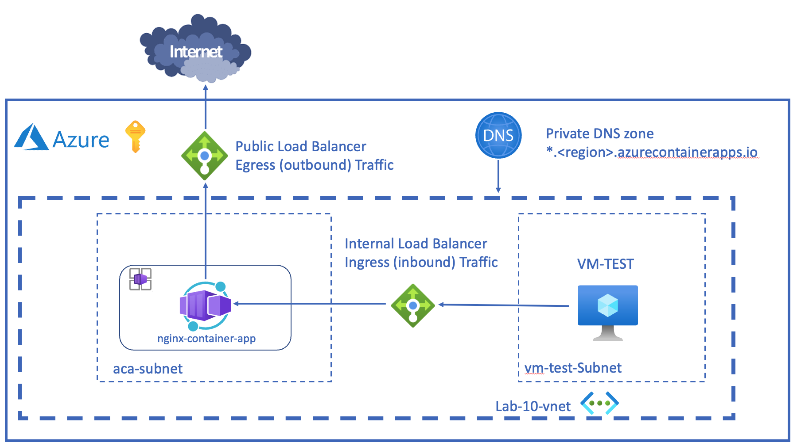
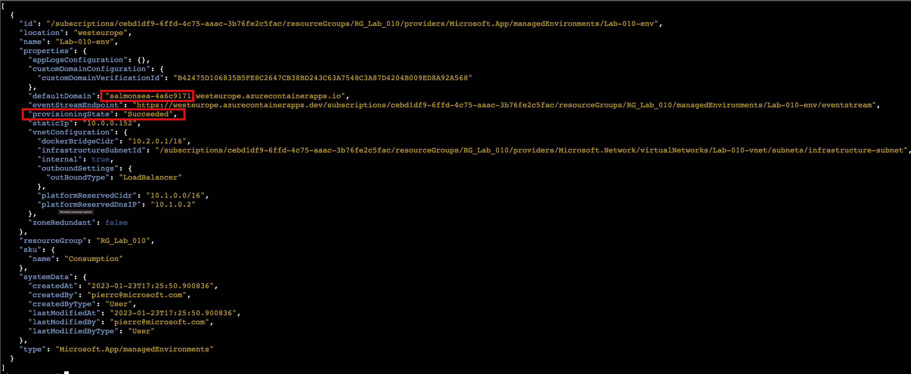
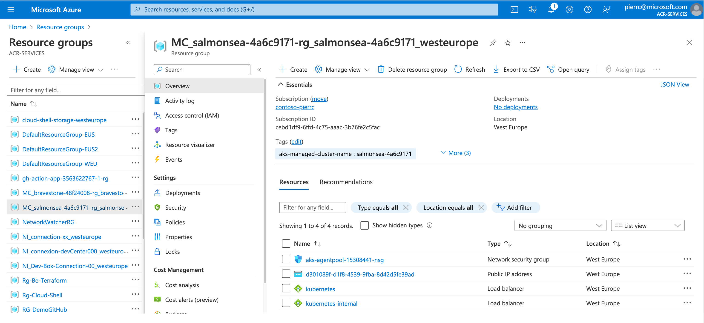
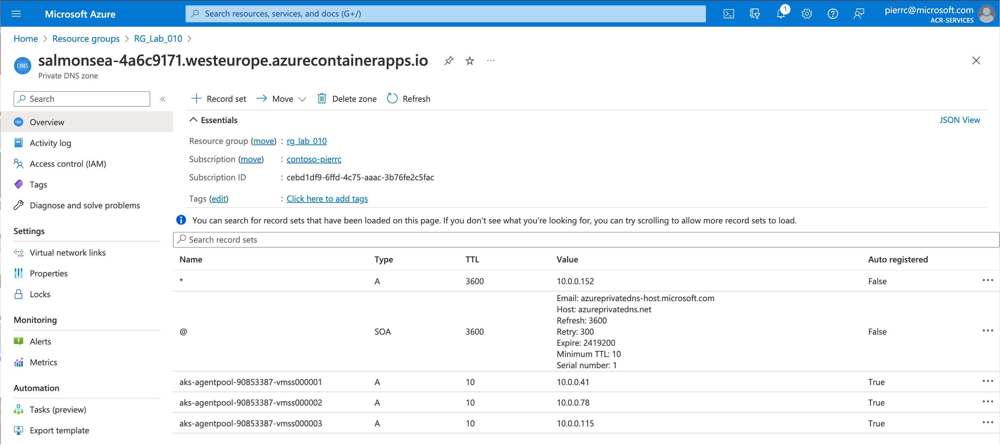

# Lab_10: Environnement privé

Azure Container Apps s'exécute dans le contexte d'un environnement, qui est pris en charge par un réseau virtuel (VNET).Lorsque vous créez un environnement, vous pouvez fournir un VNET personnalisé, sinon un VNET est automatiquement généré pour vous. Les VNET générés vous sont inaccessibles car ils sont créés dans le locataire de Microsoft. Pour avoir un contrôle total sur votre VNET, fournissez un VNET existant à Container Apps lorsque vous créez votre environnement.<br>
Ils existe deux niveaux accessibilité:
|Niveau d’accessibilité|Description                                          |
|----------------------|-----------------------------------------------------|
|Externe|Les environnements Container Apps déployés en tant que ressources externes sont disponibles pour les demandes publiques. Les environnements externes sont déployés avec une adresse IP virtuelle sur une adresse IP publique externe.|
|Interne|Lorsqu'il est défini comme interne, l'environnement n'a pas de point de terminaison public. Les environnements internes sont déployés avec une IP virtuelle (VIP) mappée sur une adresse IP interne. Le point de terminaison interne est un équilibreur de charge interne Azure (ILB) et les adresses IP proviennent de la liste d'adresses IP privées du VNET personnalisé.|
## Objectif:
L'objectif de ce Lab 10, c'est de déployer une Azure Container App dans un environnement privé (interne) dans un Vnet.<br>
Etapes pour ce Lab_10:<br>
- Création d'un "Resource Group"
- Création d'un "Virtual Network & Subnet"
- Création de "Container Apps environment with the VNET and subnet"
- Création et paramétrage d'un "private DNS"
- Création d'une "Azure Container App"
- Test dans l'environnement privé


Voici les variables:<br>
```
RESOURCE_GROUP="RG_Lab_10"
ENVIRONMENT_NAME="Lab-10-env"
LOCATION="westeurope"
VNET_NAME="Lab-10-vnet"
PREFIX_VNET="10.0.0.0/16"
SUBNET_ACA_NAME="aca-Subnet"
PREFIX_SUBNET_ACA_NAME="10.0.0.0/21"
SUBNET_VM_NAME="vm-test-Subnet"
PREFIX_SUBNET_VM_TEST="10.0.8.0/24"
PUBLIC_IP_VM="PublicIP-VM"
NSG="NSG-VM-TEST"
CONTAINER_APP_NAME="nginx-container-app"
USER_NAME="azureuser"
PASSWORD_USER="Password123$"
VM="VM-TEST"
```
Création du "Resource Group"<br>
```
az group create \
  --name $RESOURCE_GROUP \
  --location $LOCATION
```
test -> Création du "Resource Group":
```
az group show --resource-group $RESOURCE_GROUP -o table
```
Création du "Virtual Network"<br>
```
az network vnet create \
  --resource-group $RESOURCE_GROUP \
  --name $VNET_NAME \
  --location $LOCATION \
  --address-prefix $PREFIX_VNET
```
test -> Création du "Virtual Network":
```
az network vnet show --resource-group $RESOURCE_GROUP --name $VNET_NAME -o table
```
Création du "Subnet"<br>
```
az network vnet subnet create \
  --resource-group $RESOURCE_GROUP \
  --vnet-name $VNET_NAME \
  --name $SUBNET_ACA_NAME \
  --address-prefixes $PREFIX_SUBNET_ACA_NAME
```
test -> Création du "subnet":<br>
```
az network vnet subnet show --resource-group $RESOURCE_GROUP   --vnet-name $VNET_NAME --name $SUBNET_ACA_NAME -o table
```
Récupération des informations de l'id du subnet:
```
INFRASTRUCTURE_SUBNET=`az network vnet subnet show \
                         --resource-group $RESOURCE_GROUP \
                         --vnet-name $VNET_NAME \
                         --name $SUBNET_ACA_NAME \
                         --query "id" -o tsv | tr -d '[:space:]'`
```
test -> Récupération des informations de l'id du subnet
```
echo $INFRASTRUCTURE_SUBNET
```
Création de "Container Apps environment with the VNET and subnet":<br>
```
az containerapp env create \
  --name $ENVIRONMENT_NAME \
  --resource-group $RESOURCE_GROUP \
  --location $LOCATION \
  --logs-destination none \
  --infrastructure-subnet-resource-id $INFRASTRUCTURE_SUBNET \
  --internal-only
```
test et visualisation de "Container Apps environment with the VNET and subnet"
```
az containerapp env list --resource-group $RESOURCE_GROUP -o jsonc
```
Création d'un "private DNS":<br>
Récupération du default domaine de "Container Apps environment"
```
ENVIRONMENT_DEFAULT_DOMAIN=`az containerapp env show \
                              --name $ENVIRONMENT_NAME \
                              --resource-group $RESOURCE_GROUP \
                              --query properties.defaultDomain --out json | tr -d '"'`
```
Récupération de l'IP de "Container Apps environment"
```
ENVIRONMENT_STATIC_IP=`az containerapp env show \
                         --name $ENVIRONMENT_NAME \
                         --resource-group $RESOURCE_GROUP \
                         --query properties.staticIp --out json | tr -d '"'`
```
Récupération de l'id du Vnet
```
VNET_ID=`az network vnet show \
           --resource-group $RESOURCE_GROUP \
           --name $VNET_NAME \
           --query id --out json | tr -d '"'`
```
Tests -> defaul domain / IP de "Container Apps environment" / id du Vnet
```
echo $ENVIRONMENT_DEFAULT_DOMAIN
echo $ENVIRONMENT_STATIC_IP
echo $VNET_ID
```
Création d'un "private DNS":<br>
```
az network private-dns zone create \
  --resource-group $RESOURCE_GROUP \
  --name $ENVIRONMENT_DEFAULT_DOMAIN
```
Link du Vnet dans le "private DNS"
```
az network private-dns link vnet create \
  --resource-group $RESOURCE_GROUP \
  --name $VNET_NAME \
  --virtual-network $VNET_ID \
  --zone-name $ENVIRONMENT_DEFAULT_DOMAIN -e true
```
Ajout de l'enregistrement * pour la rediction sur l'ip de "Container Apps environment"
```
az network private-dns record-set a add-record \
  --resource-group $RESOURCE_GROUP \
  --record-set-name "*" \
  --ipv4-address $ENVIRONMENT_STATIC_IP \
  --zone-name $ENVIRONMENT_DEFAULT_DOMAIN
```
Avant de déployer l'Azure Container App, quelques vérifications:<br>
```
az containerapp env list --resource-group $RESOURCE_GROUP -o jsonc
```
<br>
Le "provisioningState" doit être "Succeeded"<br>
Notez le suffix du "defaultDomain"
<br>
Un nouveau "Resource group" doit être déployé (ex: MC_NOM_DU_SUFFIX_DEFAULT_DOMAIN_.......)
<br>
On doit avoir au mois trois "aks-agentpool-......."<br>
Création de l'Azure Container App:
```
az containerapp create \
  --name $CONTAINER_APP_NAME \
  --resource-group $RESOURCE_GROUP \
  --environment $ENVIRONMENT_NAME \
  --image nginx \
  --min-replicas 1 \
  --max-replicas 1 \
  --target-port 80 \
  --ingress external \
  --query properties.configuration.ingress.fqdn
```
Observez l'output de l'url <br>
Essayez de faire un curl sur l'output de l'url
```
curl https://nginx-container-app.proudglacier-77985e33.westeurope.azurecontainerapps.io/
curl: (6) Could not resolve host: nginx-container-app.proudglacier-77985e33.westeurope.azurecontainerapps.io
```
Normal, nous sommes dans un environnement "privé", pour nos tests, nous allons déployer une VM dans le subnet "vm-test-Subnet"<br>
Création de la VM de test <br>
```

az network vnet subnet create \
  --resource-group $RESOURCE_GROUP \
  --vnet-name $VNET_NAME \
  --name $SUBNET_VM_NAME \
  --address-prefixes $PREFIX_SUBNET_VM_TEST

az network public-ip create \
    --resource-group $RESOURCE_GROUP \
    --name $PUBLIC_IP_VM \
    --sku Standard

az network nsg create \
    --resource-group $RESOURCE_GROUP \
    --name $NSG

az network nsg rule create \
    --resource-group $RESOURCE_GROUP \
    --nsg-name $NSG \
    --name Rule_SSH \
    --protocol tcp \
    --priority 1000 \
    --destination-port-range 22 \
    --access allow

az network nic create \
    --resource-group $RESOURCE_GROUP \
    --name Nic001 \
    --vnet-name $VNET_NAME \
    --subnet $SUBNET_VM_NAME \
    --public-ip-address $PUBLIC_IP_VM\
    --network-security-group $NSG

az vm create \
    --resource-group $RESOURCE_GROUP \
    --name $VM \
    --location $LOCATION \
    --nics Nic001 \
    --image UbuntuLTS \
    --admin-username $USER_NAME \
    --admin-password $PASSWORD_USER
```
Récupérer la "publicIpAddress" <br>
Connectez vous à la VM de test (mdp:Password123!):<br>
```
ssh azureuser@<PULICIP>
```
Dans la VM de test, refaire un curl de l'URL de l'Azure Container App. Ex:<br>
curl https://nginx-container-app.purplerock-adf3f498.westeurope.azurecontainerapps.io
```
Cela doit nous retourner:
```
<!DOCTYPE html>
<html>
<head>
<title>Welcome to nginx!</title>
<style>
html { color-scheme: light dark; }
body { width: 35em; margin: 0 auto;
font-family: Tahoma, Verdana, Arial, sans-serif; }
</style>
</head>
<body>
<h1>Welcome to nginx!</h1>
<p>If you see this page, the nginx web server is successfully installed and
working. Further configuration is required.</p>

<p>For online documentation and support please refer to
<a href="http://nginx.org/">nginx.org</a>.<br/>
Commercial support is available at
<a href="http://nginx.com/">nginx.com</a>.</p>

<p><em>Thank you for using nginx.</em></p>
</body>
</html>
``` 
Fin du Lab_10
```
exit
az group delete --resource-group $RESOURCE_GROUP --yes
```