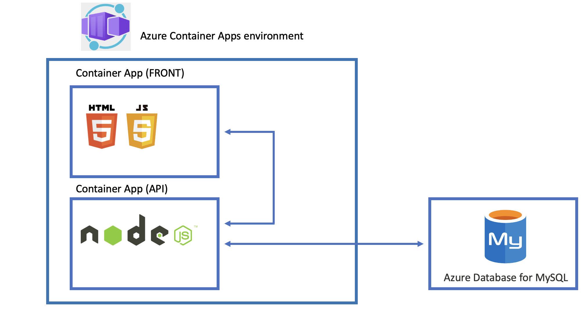
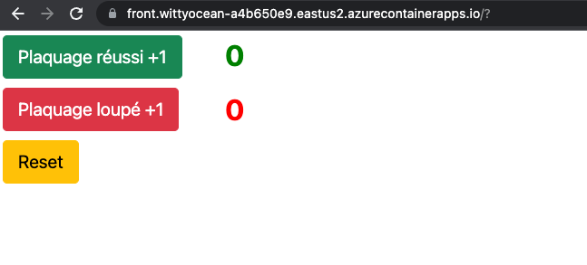

# Lab_3: Déploiement d’une application dans Azure Container Apps
<br>
## Objectif:
L'objectif de ce Lab 3 c'est de déployer une application (en micro-services) dans le service "Azure Container Apps"<br>


## Préparation de l'environnement 

### Prérequis
Le déploiement de l'environnement se fera avec un "Workflow Github" (Pipeline).<br>
Créez un Service Principal Azure Cli ou Cloud Shell:<br>
```
az ad sp create-for-rbac --name "mySPN" --role "Contributor" --scopes /subscriptions/xxxxxxxx-xxxx-xxxx-xxxx-xxxxxxxxxxx --sdk-aut -o jsonc
```
Copiez les informations dans un "notepad" ou autres<br>
Gardez cette structure:<br>
```
{
  "clientId": "xxxxxxxx-xxxx-xxxx-xxxx-xxxxxxxxxxxx",
  "clientSecret": "xxxxxxxxxxxxxxxxxxxxxxxxxxxxxxxxxxxx",
  "subscriptionId": "xxxxxxxx-xxxx-xxxx-xxxx-xxxxxxxxxxxx",
  "tenantId": "xxxxxxxx-xxxx-xxxx-xxxx-xxxxxxxxxxxx"
}
```
Dans GitHub, allez dans le service secret:<br>
<br>
Dans le service secret, créez un secret "AZURE_CREDENTIALS"<br>
Et mettez le "Service Principal" comme ci-dessous:<br>
<br>

### Déploiement de l'environnement
Le  "Workflow Github" (Pipeline) déploie:<br>
- un "resource group"
- un service "Azure Database for MySQL single server"
- une base de donnée + 2 tables + règle de pare-feu
- une "Azure Container Registry"
- un "Log Analytics workspace"
- un "Container Apps Environment"

Le workflow est ici: `.github/workflows/Lab_3_deployment_environnment.yaml`<br>
Paramatrez le bloc de variables du workflows, lignes 6 -> 18 <br>
```
env:
  RESOURCE_GROUP: "RG-Lab3"
  LOCATION: "eastus2"
  CONTAINERAPPS_ENVIRONMENT: "environment-lab-3"
  LOG_ANALYTICS_NAME: "pierrc-workspace-lab-3"
  ACR_NAME: "acrlab3xxx"
  DB_HOST_NAME: "DB-lab-3-xxx"
  DB_NAME: "rugby_api" # ne pas modifier
  DB_ADMIN: "pierrc"
  DB_ADMIN_PASSWORD: Password123$       
```
**Informations importantes !**<br>
**Nous sommes dans un Workshop !**<br>
**Dans les bonnes pratiques, toutes la informations liées à la base de données sont à mettre dans un service pour stocker les secrets (ex: service secrets GitHub, KeyVault, ...)**<br>

Pour déclancher le workflow:<br>
<br>
<br>
Pour suivre l'exécution du workflows:<br>
<br>
<br>
<br>
<br>
<br>
<br>
<br>

Test du déploiement<br>
"Resource Group":<br>
```
az group list -o table
```
"MySQL"<br>
```
az mysql server list -g RG-Lab3
```
"Environement Azure Container Apps"<br>
```
az containerapp env list -g RG-Lab3
```
"Azure Container Registry"<br>
```
az acr list -g RG-Lab3
```
## "Build and Push" Applications & installation
### API
En Azure Cli ou Cloud Shell:<br>
```
cd ./Lab_3/App/api
az acr build -t acrlab3xxx.azurecr.io/api:1.0.0 -r acrlab3xxx .
```
Vérification de l'image:<br>
```
az acr repository list --name acrlab3xxx -o table
```
Résultat:<br>
```
Result
--------
api
```
Déploiement de l'application "api":<br>
```
az containerapp create \
  --name api \
  --resource-group RG-Lab3 \
  --environment environment-lab-3 \
  --image acrlab3xxx.azurecr.io/api:1.0.0 \
  --secrets secret-db-host=db-lab-3-xxx.mysql.database.azure.com secret-db-user=pierrc@db-lab-3-xxx secret-db-password=Password123$ secret-db-database=rugby_api \
  --env-vars DB_HOST=secretref:secret-db-host DB_USER=secretref:secret-db-user DB_PASSWORD=secretref:secret-db-password DB_DATABASE=secretref:secret-db-database \
  --target-port 3000 \
  --ingress external \
  --registry-server acrlab3xxx.azurecr.io \
  --query configuration.ingress.fqdn
```

**Vérification de l'application "api":**<br>
```
curl https://api.lemonriver-7b314584.eastus2.azurecontainerapps.io/
```
Résultat:<br>
```
{"message":"API v.1.0.0"}
```
**Vérification de l'application "api" avec la connexion à la base de donnée:**<br>
Pour la table "table plaquage_ok<br>
```
curl https://api.lemonriver-7b314584.eastus2.azurecontainerapps.io/plaquage-ok/get
```
Résultat :<br>
```
[{"Id":1,"sum_plaquage_ok":0}]
```

Pour la table "table plaquage_ko<br>
```
curl https://api.lemonriver-7b314584.eastus2.azurecontainerapps.io/plaquage-ko/get
```
Résultat :<br>
```
[{"Id":1,"sum_plaquage_ko":0}]
```

### FRONT
Récupération de l'url de l'api:<br>
```
URL_API=$(az containerapp show --resource-group RG-Lab3 --name api --query properties.configuration.ingress.fqdn -o tsv) 
```
Test de l'url:<br>
```
echo $URL_API
```
Résultat:<br>
```
api.bravesea-df4ca2c0.eastus2.azurecontainerapps.io
```
Observez le fichier `./Lab_3/App/front/index.html`<br>
Il faut remplacer `http://localhost:3000` par l'url de l'API (quatre lignes)<br>
ex: <br>
```
http://localhost:3000/plaquage-ok/get
```
en
```
https://api.bravesea-df4ca2c0.eastus2.azurecontainerapps.io/plaquage-ok/get
```
Pour le faire facilement, nous le ferons dans ce lab avec la commande `sed`
```
sed -i -e 's%\http://localhost:3000%https://'$URL_API'%' ./Lab_3/App/front/index.html
```
Vérifiez les changements.<br>
**Buid & Push front**
```
cd ./Lab_3/App/front
az acr build -t acrlab3xxx.azurecr.io/front:1.0.0 -r acrlab3xxx .
```
**Déploiement de l'application Front**
```
az containerapp create \
  --name front \
  --resource-group RG-Lab3 \
  --environment environment-lab-3 \
  --image acrlab3xxx.azurecr.io/front:1.0.0 \
  --target-port 80 \
  --ingress 'external' \
  --registry-server acrlab3xxx.azurecr.io \
  --query configuration.ingress.fqdn
```
Récupérez l'URL en la copiant (ex: https://front.wittyocean-a4b650e9.eastus2.azurecontainerapps.io/)<br>
Lancez votre navigateur et collez l'URL:<br>
<br>

## Fin du Lab_3
```
az group delete --resource-group RG-Lab3
```
