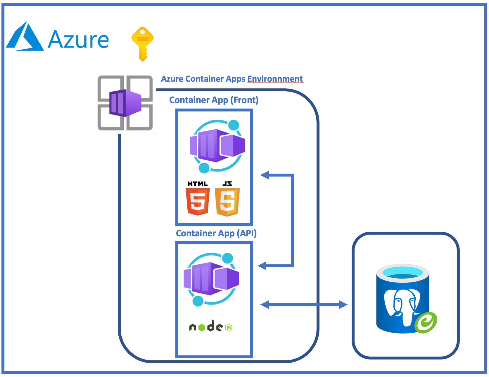
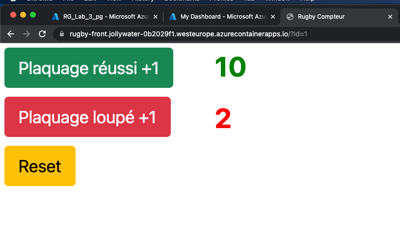

# Lab_3: Déploiement d’une application dans Azure Container Apps
<br>
## Objectif:
L'objectif de ce Lab 3 c'est de déployer une application (en micro-services) dans le service "Azure Container Apps"<br>
### Etapes du Lab:
- Création de la Base de donnée
- Déploiement de "Azure Apps Environnment"
- Déploiement d'une "Azure Container Registry"
- "Build & Push" de l'image API
- Déploiement et tests de "App Container" API
- "Build & Push" de l'image Front
- Déploiement et tests de "App Container" FRONT

Variables pour ce Lab
```
RESOURCE_GROUP="RG_Lab_3_pg"
LOCATION="westeurope"
POSTGRESQL_NAME="pglab3"
POSTGRESQL_ADMINUSER="adminDB"
POSTGRESQL_ADMINPASSWORD="Password123$"
POSTGRESQL_SKUNAME="Standard_B1ms"
POSTGRESQL_TIER="Burstable"
POSTGRESQL_VERSION="14"
POSTGRESQL_STORAGESIZE="32"
POSTGRESQL_DBNAME="rugby_api"
ACR_NAME="acrlab3pg"
ACR_SKUNAME="Standard"
APP_API_NAME="rugby-api"
APP_API_IMAGE_VERSION="1.0.0"
APP_FRONT_NAME="rugby-front"
APP_FRONT_IMAGE_VERSION="1.0.0"
ENVIRONMENT_NAME="Lab-3-pg-env"

```
Création de "resource group"
```
az group create \
  --name $RESOURCE_GROUP \
  --location $LOCATION
```
Test -> Création de "resource group"
```
az group show --resource-group $RESOURCE_GROUP -o table
```
Création du "logical server"
```
az postgres flexible-server create \
  --name $POSTGRESQL_NAME \
  --resource-group $RESOURCE_GROUP \
  --location $LOCATION \
  --admin-user $POSTGRESQL_ADMINUSER \
  --admin-password $POSTGRESQL_ADMINPASSWORD \
  --sku-name $POSTGRESQL_SKUNAME \
  --tier $POSTGRESQL_TIER \
  --version $POSTGRESQL_VERSION \
  --storage-size $POSTGRESQL_STORAGESIZE \
  --public-access 0.0.0.0 --yes
```
Test -> Création du "logical server"
```
az postgres flexible-server show --resource-group $RESOURCE_GROUP --name $POSTGRESQL_NAME -o table
```
Création "Firewall rule to allow access from internet"
```
az postgres flexible-server firewall-rule create \
  --name $POSTGRESQL_NAME \
  --resource-group $RESOURCE_GROUP \
  --rule-name allowall \
  --start-ip-address 0.0.0.0 \
  --end-ip-address 255.255.255.255
```
Authorisation "Allow non-SSL connections" (Pas conseillé / Mode Workshop ! ...)
```
az postgres flexible-server parameter set \
  --resource-group $RESOURCE_GROUP \
  --server-name $POSTGRESQL_NAME \
  --name require_secure_transport --value off
```
Création de la base
```
az postgres flexible-server db create \
  --resource-group $RESOURCE_GROUP \
  --server-name $POSTGRESQL_NAME \
  --database-name $POSTGRESQL_DBNAME
```
Test -> Création de la base
```
az postgres flexible-server db show --resource-group $RESOURCE_GROUP --server-name $POSTGRESQL_NAME --database-name $POSTGRESQL_DBNAME -o table
```
Création des tables<br>
Allez dans ./Lab_3_pg/DB
```
az postgres flexible-server execute \
  --admin-password $POSTGRESQL_ADMINPASSWORD \
  --admin-user $POSTGRESQL_ADMINUSER \
  --name $POSTGRESQL_NAME \
  --database-name $POSTGRESQL_DBNAME \
  --file-path create_tables.sql
```
Création de "Container Apps environment":
```
az containerapp env create \
  --name $ENVIRONMENT_NAME \
  --resource-group $RESOURCE_GROUP \
  --location $LOCATION \
  --logs-destination none
```
Test -> Visualisation de "Container Apps environment"
```
az containerapp env list --resource-group $RESOURCE_GROUP -o jsonc
```
Création de "Azure Container Registry"
```
az acr create \
  --resource-group $RESOURCE_GROUP \
  --name $ACR_NAME \
  --sku $ACR_SKUNAME \
  --admin-enabled true
```
Test -> Création de "Azure Container Registry"
```
az acr list --resource-group $RESOURCE_GROUP -o table
```
Build et Push Image API<br>
Allez dans `./Lab_3_pg/API`
```
az acr build -t $ACR_NAME.azurecr.io/$APP_API_NAME:$APP_API_IMAGE_VERSION -r $ACR_NAME .
```
Test -> Build et Push Image API
```
az acr repository list --name $ACR_NAME -o table
```

Avant de déployer l'API <br>
Exécutez la commande `az containerapp env list --resource-group $RESOURCE_GROUP -o jsonc`<br>
Vérifier l'état : `"provisioningState": "Succeeded"`<br>
Déploiement API dans Azure Container Apps
```
REGISTRY_PASSWORD=$(az acr credential show --name $ACR_NAME -o tsv --query "passwords[0].value")
az containerapp create \
  --name $APP_API_NAME \
  --resource-group $RESOURCE_GROUP \
  --environment $ENVIRONMENT_NAME \
  --image $ACR_NAME.azurecr.io/$APP_API_NAME:$APP_API_IMAGE_VERSION \
  --registry-username $ACR_NAME \
  --registry-password $REGISTRY_PASSWORD \
  --secrets secret-db-host=pglab3.postgres.database.azure.com secret-db-user=adminDB secret-db-password=Password123$ secret-db-database=rugby_api secret-db-port=5432 \
  --env-vars DB_HOST=secretref:secret-db-host DB_USER=secretref:secret-db-user DB_PASS=secretref:secret-db-password DB_NAME=secretref:secret-db-database DB_PORT=secretref:secret-db-port \
  --target-port 3000 \
  --ingress external \
  --registry-server $ACR_NAME.azurecr.io \
  --query configuration.ingress.fqdn
```
Test API<br>
Récupérer l'output de l'api ex:<br>
Version API
```
curl https://rugby-api.purpleisland-7a4fc55f.westeurope.azurecontainerapps.io/api
```
Résultat
```
{"message":"API v.1.0.0"}
```
Nombre de plaquages OK
```
curl https://rugby-api.purpleisland-7a4fc55f.westeurope.azurecontainerapps.io/plaquage-ok/get
```
Résultat
```
[{"id":1,"sum_plaquage_ok":0}]
```
Ajout de plaquage OK
```
curl -X POST -H "Content-Type: application/json" https://rugby-api.purpleisland-7a4fc55f.westeurope.azurecontainerapps.io/plaquage-ok/add
```
Reset plaquage OK
```
curl -X POST -H "Content-Type: application/json" https://rugby-api.purpleisland-7a4fc55f.westeurope.azurecontainerapps.io/plaquage-ok/reset
```
On peut également faire également sur les plaquages KO
```
curl https://rugby-api.purpleisland-7a4fc55f.westeurope.azurecontainerapps.io/plaquage-ko/get
curl -X POST -H "Content-Type: application/json" https://rugby-api.purpleisland-7a4fc55f.westeurope.azurecontainerapps.io/plaquage-ko/add
curl -X POST -H "Content-Type: application/json" https://rugby-api.purpleisland-7a4fc55f.westeurope.azurecontainerapps.io/plaquage-ko/reset
```
Pour le Front<br>
Récupération de l'url de l'api:<br>
```
URL_API=$(az containerapp show --resource-group $RESOURCE_GROUP --name $APP_API_NAME --query properties.configuration.ingress.fqdn -o tsv) 
```
Test de l'url:<br>
```
echo $URL_API
```
Résultat:<br>
```
rugby-api.purpleisland-7a4fc55f.westeurope.azurecontainerapps.io
```
Allez dans `./Lab_3_pg/FRONT`<br>
Observez le fichier `index.html`<br>
Il faut remplacer `http://localhost:3000` par l'url de l'API (six lignes)<br>
ex: <br>
```
http://localhost:3000/plaquage-ok/get
```
en
```
https://rugby-api.purpleisland-7a4fc55f.westeurope.azurecontainerapps.io/plaquage-ok/get
```
Pour le faire facilement, nous le ferons dans ce lab avec la commande `sed`
```
sed -i -e 's%\http://localhost:3000%https://'$URL_API'%' ./index.html
```
Build et Push Image FRONT<br>
```
az acr build -t $ACR_NAME.azurecr.io/$APP_FRONT_NAME:$APP_FRONT_IMAGE_VERSION -r $ACR_NAME .
```
Test -> Build et Push Image FRONT
```
az acr repository list --name $ACR_NAME -o table
```
Déploiement FRONT dans Azure Container Apps
```
REGISTRY_PASSWORD=$(az acr credential show --name $ACR_NAME -o tsv --query "passwords[0].value")
az containerapp create \
  --name $APP_FRONT_NAME \
  --resource-group $RESOURCE_GROUP \
  --environment $ENVIRONMENT_NAME \
  --image $ACR_NAME.azurecr.io/$APP_FRONT_NAME:$APP_FRONT_IMAGE_VERSION \
  --target-port 80 \
  --ingress external \
  --registry-server $ACR_NAME.azurecr.io \
  --registry-username $ACR_NAME \
  --registry-password $REGISTRY_PASSWORD \
  --query configuration.ingress.fqdn
```
Test du FRONT<br>
Récupérez l'output et tester dans un navigateur<br>
<br>
