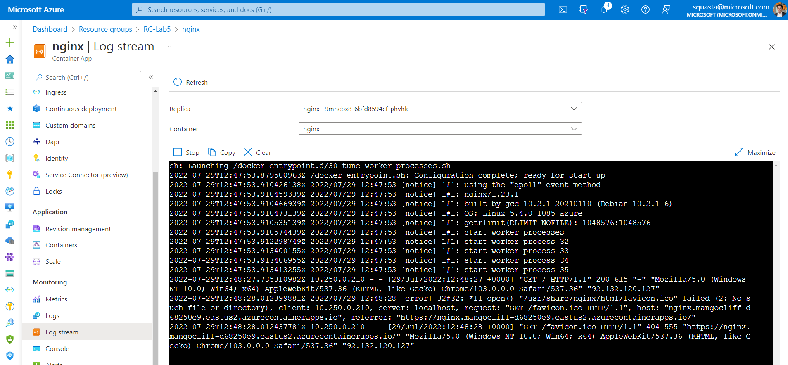

# Lab_5 Supervision d'Azure Container Apps
tags : #azure #azurecontainerapps #azurecli #cli #monitor #monitor #logs #metrics 

## Objectifs
Découvrir comment pour une Application Container : 
- Afficher les X derniers logs
- Afficher les logs applicatifs en temps réel 
- Faire des requêtes sur les logs stockés dans Azure Log Analytics
- Observer les métriques

## Pré-requis sur le poste d'administration
- Un abonnement Azure avec les privilèges d'administration (idéalement owner)
- Un environnement Shell sous Bash
- Azure CLI 2.37 or >: [https://docs.microsoft.com/en-us/cli/azure/install-azure-cli?view=azure-cli-latest](https://docs.microsoft.com/en-us/cli/azure/install-azure-cli?view=azure-cli-latest) 

Les opérations sont réalisables depuis l'Azure Cloud Shell (Bash Shell) : https://shell.azure.com 

__Ce Lab est indépendant des autres labs__

### Optionnel
- Installer l'outil "ddosify" : https://github.com/ddosify/ddosify

### Affectation des variables

```bash
RESOURCE_GROUP="RG-Lab5"
LOCATION="eastus2"
CONTAINERAPP_NAME="nginx"
CONTAINERAPPS_ENVIRONMENT="my-environment-lab5"
LOG_ANALYTICS_NAME="stan-workspace-lab5"
```

### Création d'un ressource group

```bash
az group create \
  --name $RESOURCE_GROUP \
  --location $LOCATION -o table
```

### Création d'un Log Analytics Workspace

Créer un Log Analytics Workspace qui sera utilisé pour les logs et métriques d'Azure Container Apps

```bash
az monitor log-analytics workspace create \
 --resource-group $RESOURCE_GROUP \
 --workspace-name $LOG_ANALYTICS_NAME \
 --location $LOCATION \
 -o jsonc

LOG_ANALYTICS_WORKSPACE_CLIENT_ID=`az monitor log-analytics workspace show --query customerId -g $RESOURCE_GROUP -n $LOG_ANALYTICS_NAME --out tsv`

LOG_ANALYTICS_WORKSPACE_PRIMARY_KEY=`az monitor log-analytics workspace get-shared-keys --query primarySharedKey -g $RESOURCE_GROUP -n $LOG_ANALYTICS_NAME --out tsv`

```

Informations complémentaires sur les commandes pour récupérer les informations sur le workspace Log Analytics:
- https://docs.azure.cn/en-us/cli/monitor/log-analytics/workspace?view=azure-cli-latest
- https://docs.azure.cn/en-us/cli/monitor/log-analytics/workspace?view=azure-cli-latest#az-monitor-log-analytics-workspace-get-shared-keys

### Création d'un environnement
```bash
az containerapp env create \
  --name $CONTAINERAPPS_ENVIRONMENT \
  --resource-group $RESOURCE_GROUP \
  --location $LOCATION \
  --logs-workspace-id $LOG_ANALYTICS_WORKSPACE_CLIENT_ID \
  --logs-workspace-key $LOG_ANALYTICS_WORKSPACE_PRIMARY_KEY \
  -o jsonc
```

### Déploiement d'une Container App simple (serveur nginx)
```bash
az containerapp create \
  --name $CONTAINERAPP_NAME \
  --resource-group $RESOURCE_GROUP \
  --environment $CONTAINERAPPS_ENVIRONMENT \
  --image docker.io/nginx:latest \
  --target-port 80 \
  --ingress 'external' \
  --query properties.configuration.ingress.fqdn \
  -o jsonc
```

Vérification du déploiement : ouvrir un navigateur Web et saisir le FQDN renvoyé par la commande précédente

## Voir les logs en temps réel
Il est souvent utile de consulter les journaux d’un conteneur en temps réel. Container Apps vous permet d’afficher un stream des messages des journaux `stdout` et `stderr` des conteneurs en utilisant le portail Azure ou l’interface Azure CLI.

### Avec le portail Azure
Dans le portail Azure, aller dans la ressource Container App "nginx" créée dans le resource group "RG-Lab5", et sélectionner le menu __Log Stream__ dans les options de monitoring à gauche.



Rafraichir la page dans le navigateur pour voir de nouveaux évènements apparaitre dans les logs.

### Avec Azure CLI
Pour afficher les journaux des applications d’un conteneur à partir d’Azure CLI, utilisez la commande `az containerapp logs show`. 

cf. https://docs.microsoft.com/en-us/cli/azure/containerapp/logs?view=azure-cli-latest#az-containerapp-logs-show

Afficher les 20 dernières lignes (valeur par défaut):

```bash
az containerapp logs show \
-n $CONTAINERAPP_NAME -g $RESOURCE_GROUP
```

Il est possible les entrées de journal précédentes avec l’argument `--tail`. 

Rafraichir (une douzaine de fois) plusieurs fois la page dans le navigateur pour voir de nouveaux évènements 

Afficher les 50 dernières lignes :
```bash
az containerapp logs show \
  --name $CONTAINERAPP_NAME \
  --resource-group $RESOURCE_GROUP \
  --tail 50
```

Pour afficher un stream en direct, utilisez l’argument `--follow` . Sélectionnez Ctrl-C pour arrêter le stream en direct.

Afficher les 30 dernières lignes et le stream en direct :
```bash
az containerapp logs show \
  --name $CONTAINERAPP_NAME \
  --resource-group $RESOURCE_GROUP \
  --follow --tail 15
```

Il est possible d'afficher un stream de journaux à partir d’un conteneur dans une Container App avec plusieurs révisions, réplicas et conteneurs en ajoutant les arguments `--revision`, `--replica` et `--container` à la commande `az containerapp show`.


## Faire des requêtes sur les logs 

### Depuis le portail Azure
Dans le resource group "RG-Lab5", aller dans le Log Analytics Worskspace de ce lab et sélectionner "Logs" dans le menu de gauche. 

Créer une nouvelle requête (qui récupère les 10 derniers logs de la Container App appelé nginx) en copiant/collant la requête Kusto suivante. Changer le time range en choisissant la dernière heure et l'exécuter avec le __bouton Run__

```bash
ContainerAppConsoleLogs_CL | where ContainerAppName_s == 'nginx' | project ContainerAppName_s, Log_s, TimeGenerated | take 10
```

Dans le panneau Results  (en bas à droite), cliquer sur > pour avoir plus de détails.

La liste des champs disponibles dans la table Custom "ContainerAppConsoleLogs_CL" est visible dans le panneau central en bas.


Informations additionnelles pour le langage Kusto : https://docs.microsoft.com/en-us/azure/data-explorer/kusto/query/

### Depuis Azure CLI
Lancer une requête sur le Workspace

```bash
az monitor log-analytics query \
--workspace $LOG_ANALYTICS_WORKSPACE_CLIENT_ID \
--analytics-query "ContainerAppConsoleLogs_CL | where ContainerAppName_s=='$CONTAINERAPP_NAME' | project ContainerAppName_s, Log_s, TimeGenerated | take 5" -o table
```

Note : si c'est la première fois que vous exécutez ce type de commande, le message suivant apparaitra :

```bash
The command requires the extension log-analytics. Do you want to install it now? The command will continue to run after the extension is installed. (Y/n):
```

Répondre avec __Y__

Le résultat doit avoir la forme suivante :
```bash
ContainerAppName_s    Log_s                                                                         TableName      TimeGenerated
--------------------  ----------------------------------------------------------------------------  -------------  ------------------------
nginx                 2022/07/29 12:56:20 [notice] 1#1: signal 3 (SIGQUIT) received, shutting down  PrimaryResult  2022-07-29T12:56:23.365Z
nginx                 2022/07/29 12:56:20 [notice] 33#33: gracefully shutting down                  PrimaryResult  2022-07-29T12:56:23.365Z
nginx                 2022/07/29 12:56:20 [notice] 35#35: gracefully shutting down                  PrimaryResult  2022-07-29T12:56:23.365Z
nginx                 2022/07/29 12:56:20 [notice] 34#34: gracefully shutting down                  PrimaryResult  2022-07-29T12:56:23.365Z
nginx                 2022/07/29 12:56:20 [notice] 33#33: exiting                                   PrimaryResult  2022-07-29T12:56:23.365Z
```

## Observer les métriques
Azure Monitor collecte les données des métriques des Container Apps à intervalles réguliers. Ces métriques aident à obtenir des insights sur les performances et l’intégrité de la container App.

Liste des métriques disponibles : https://docs.microsoft.com/en-us/azure/container-apps/observability?tabs=bash#available-metrics-for-container-apps

### Depuis le portail Azure 

Utiliser Metrics Explorer dans le portail Azure pour monitorer et analyser les données des métriques.


Vous pouvez utiliser le service __Azure Load Testing__ ou __ddosify__ (https://github.com/ddosify/ddosify) pour "bombarder" des requêtes sur l'url de la Container App et voir les métriques changer.

## Fin du Lab 5
Supprimer le resource group "RG-Lab5"
```bash
az group delete -n "RG-Lab5" -o jsonc
```
