# Lab_6: Pipeline CD
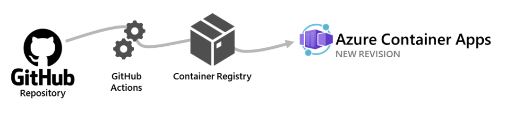<br>
## Objectif:
L'objectif de ce Lab 6, c'est d'utiliser les "GitHub Actions" pour publier les révisions d'une application de conteneur. Au fur et à mesure que les "commits" sont poussés vers le dépôt GitHub, une "GitHub Actions" est déclenchée et met à jour l'image du conteneur dans "l'Azure Container Registry". Une fois le conteneur mis à jour dans cette dernière, Azure Container Apps crée une nouvelle révision basée sur l'image de conteneur mise à jour.

## Préparation de l'environnement
Création d'un "service principal"<br>
```
az ad sp create-for-rbac --name "mySPN" --role "Contributor" --scopes /subscriptions/xxxxxxxx-xxxx-xxxx-xxxx-xxxxxxxxxxx --sdk-aut -o jsonc
```
Copiez les informations dans un "notepad" ou autres (on s'en servira pour le Lab 9)<br>
Gardez cette structure:<br>
```
{
  "clientId": "xxxxxxxx-xxxx-xxxx-xxxx-xxxxxxxxxxxx",
  "clientSecret": "xxxxxxxxxxxxxxxxxxxxxxxxxxxxxxxxxxxx",
  "subscriptionId": "xxxxxxxx-xxxx-xxxx-xxxx-xxxxxxxxxxxx",
  "tenantId": "xxxxxxxx-xxxx-xxxx-xxxx-xxxxxxxxxxxx"
}
```

Affectation des variables:<br>
```
RESOURCE_GROUP="RG-Lab6"
LOCATION="eastus2"
ACR_NAME="acrlab6"
LOG_ANALYTICS_NAME="pierrc-workspace-lab-6"
CONTAINERAPPS_ENVIRONMENT="environment-lab-6"
APPLICATION="hello"


```
Installation de l'environnement:<br>
```
az extension add --name containerapp --upgrade
az provider register --namespace Microsoft.App
az provider register --namespace Microsoft.OperationalInsights

az group create \
  --name ${RESOURCE_GROUP} \
  --location ${LOCATION}

az acr create \
  --resource-group ${RESOURCE_GROUP} \
  --name ${ACR_NAME} \
  --sku Basic \
  --admin-enabled true

az monitor log-analytics workspace create \
  --resource-group ${RESOURCE_GROUP} \
  --workspace-name ${LOG_ANALYTICS_NAME} \
  --location ${LOCATION}
LOG_ANALYTICS_WORKSPACE_CLIENT_ID=`az monitor log-analytics workspace show --query customerId -g ${RESOURCE_GROUP} -n ${LOG_ANALYTICS_NAME} --out tsv`
LOG_ANALYTICS_WORKSPACE_PRIMARY_KEY=`az monitor log-analytics workspace get-shared-keys --query primarySharedKey -g ${RESOURCE_GROUP} -n ${LOG_ANALYTICS_NAME} --out tsv`

az containerapp env create \
  --name ${CONTAINERAPPS_ENVIRONMENT} \
  --resource-group ${RESOURCE_GROUP} \
  --location ${LOCATION} \
  --logs-workspace-id $LOG_ANALYTICS_WORKSPACE_CLIENT_ID \
  --logs-workspace-key $LOG_ANALYTICS_WORKSPACE_PRIMARY_KEY
```

## "Build & Push" l'application

```
cd ./Lab_6/App
az acr build -t ${ACR_NAME}.azurecr.io/${APPLICATION}:1.0.0 -r ${ACR_NAME} .
```

## Déploiement de l'application
```
az containerapp create \
  --name ${APPLICATION} \
  --resource-group ${RESOURCE_GROUP} \
  --environment ${CONTAINERAPPS_ENVIRONMENT} \
  --image ${ACR_NAME}.azurecr.io/${APPLICATION}:1.0.0 \
  --target-port 3000 \
  --ingress external \
  --registry-server ${ACR_NAME}.azurecr.io \
  --query configuration.ingress.fqdn
```
A la fin de l'installation:<br>
```
Container app created. Access your app at https://hello.kinddune-d6b77287.eastus2.azurecontainerapps.io/
```
Test de l'application:<br>
Faire un "curl" sur l'URL ex: `curl https://hello.kinddune-d6b77287.eastus2.azurecontainerapps.io` 

## Mise en place du "Continous deployment"
Dans la console Azure:<br>
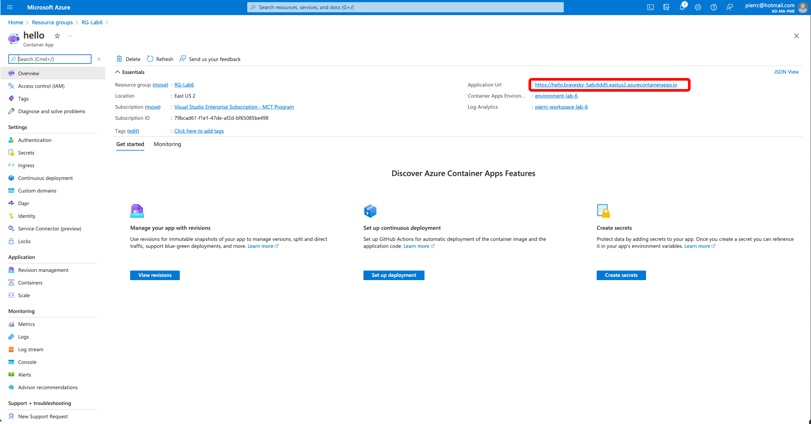<br>
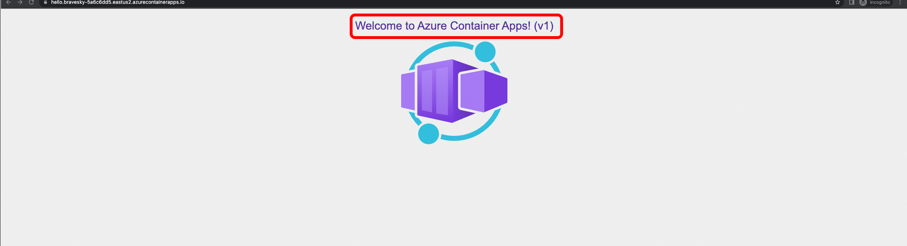<br>
Nous avons ici notre première version<br><br>

**Paramétrage du "Continous deployment"**
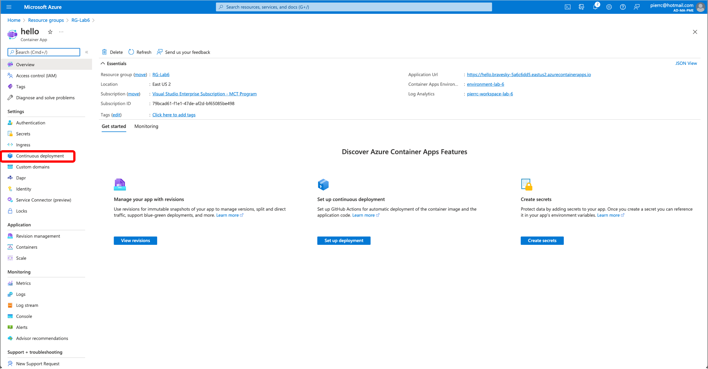<br>
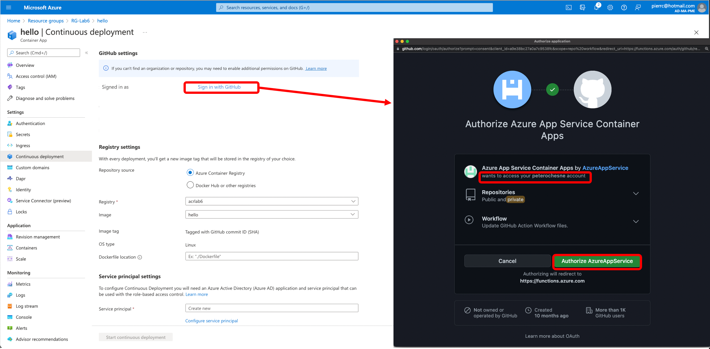<br>
Au niveau de cet assistant, on donne les droits nécessaires au service "Azure Container Apps" dans votre Compte ou Organisation GitHub<br><br> 
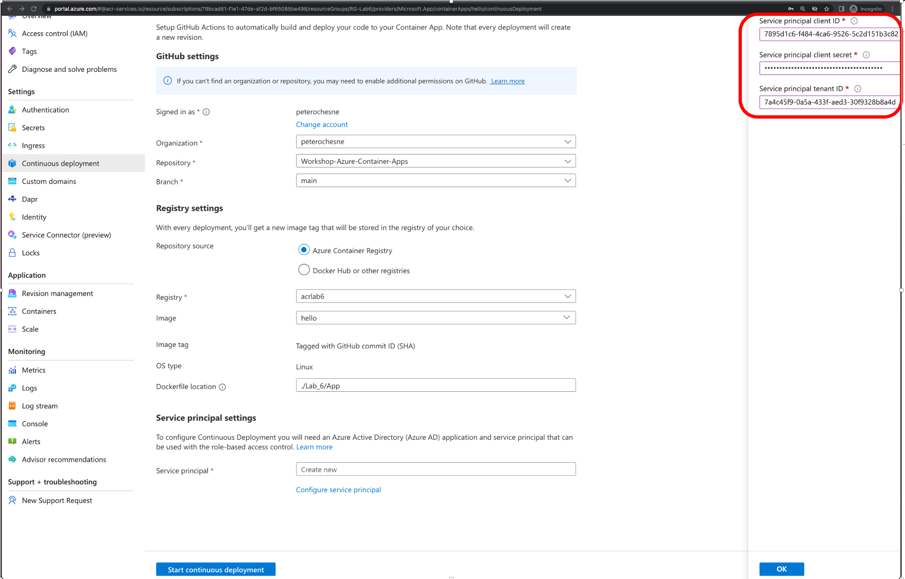<br>
Au niveau de cet assistant, on renseigne:<br>
Github:

- Organization GitHub -> Compte GitHub
- Repository -> Workshop-Azure-Container-Apps
- Branch -> main

Registry setting:

- Sélectionnez "Azure Container Registry"
- Allez chercher l' "Azure Container Registry" qui a été déployée lors de la préparation de l'environnement
- Sélectionnez l'image qui été construite lors de la préparation de l'environnement
- Mettre le chemin du Dockerfile de l'application

Service principal setting:

- ID du SPN (créé lors du Lab 3)
- le secret du SPN
- ID de votre tenant<br><br>

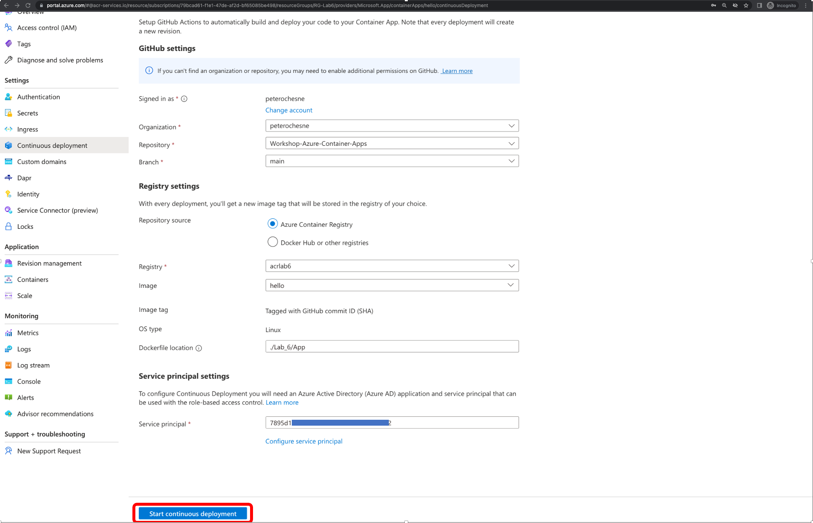<br>
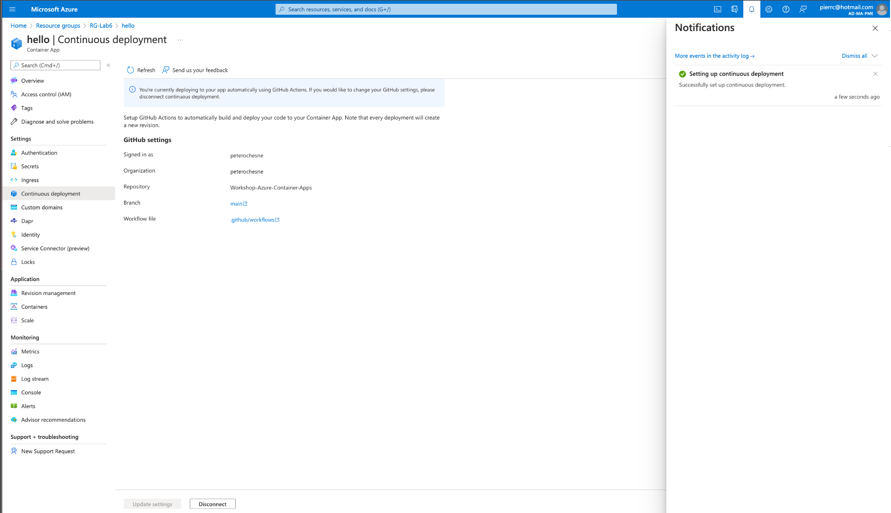<br>
<br><br>
Sur la partie GitHub:<br>
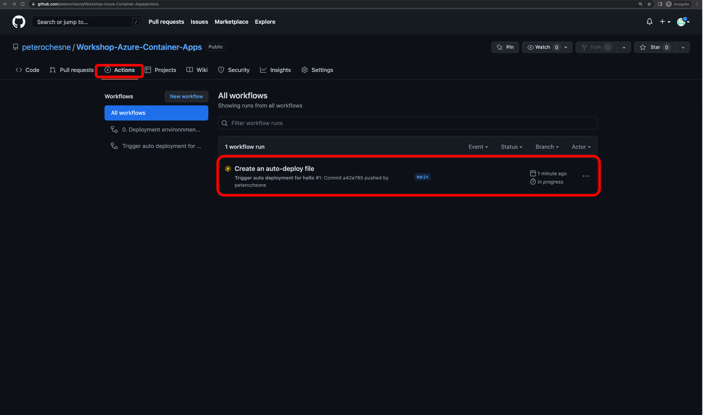<br>
Un Workflow a été généré automatiquement et ce dernier s'exécute automatiquement
<br><br> 
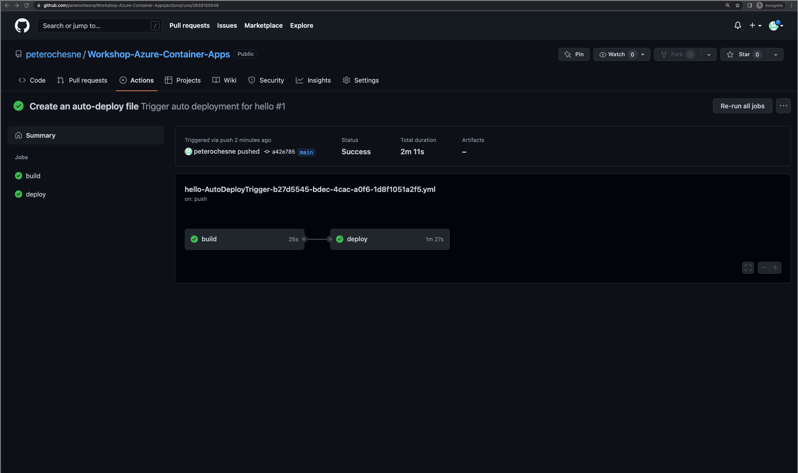<br>
Avec deux jobs:<br>

- Build
- Deploy

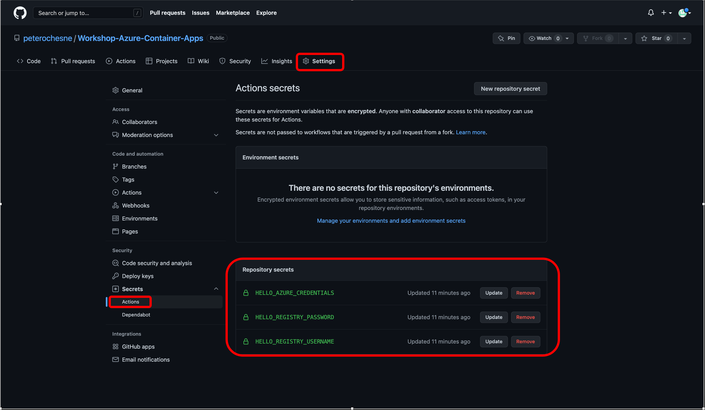<br>
Trois secrets ont été créés:<br>

- HELLO_AZURE_CREDENTIALS (donne les droits à GitHub sur l'abonnement/Ressource (SPN))
- HELLO_AZURE_REGISTRY_PASSWORD (mot de passe de ACR pour le "Push" de l'application)
- HELLO_AZURE_REGISTRY_USERNAME (Registry name)
<br><br>
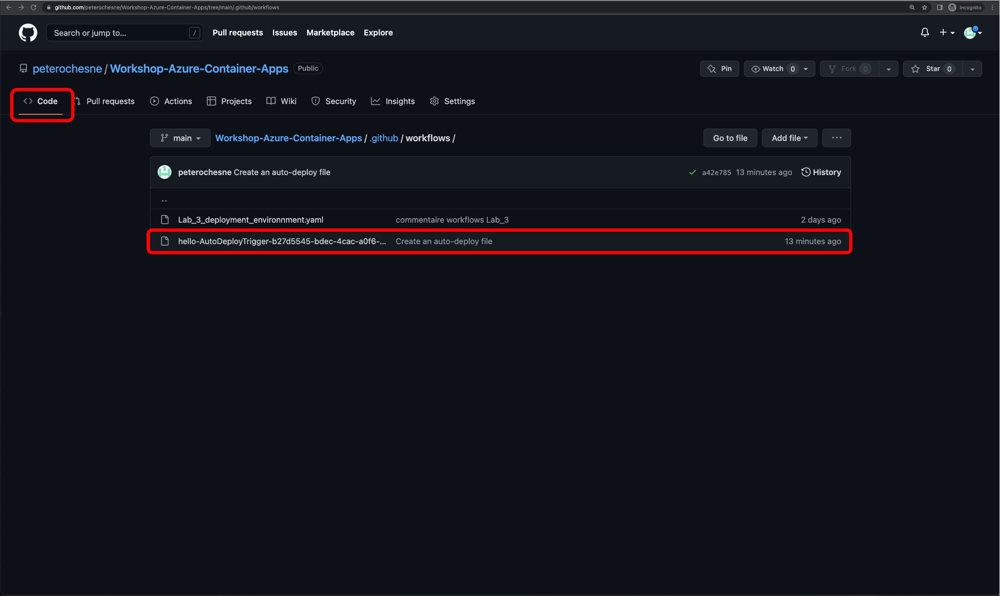<br>
<br>
Au niveau du Workflows(ci-dessus):<br>

- Le workflow se déclenche sur un push sur la branche "main" dans le path de l'application ou une modification du workflows (lignes 4 à 11)
- Le workflow peut également se déclencher manuellement (ligne 14)
- Le job "build" s'éxecute sur un "Runner GitHub" sur un OS Ubuntu LTS-20.04.4 (ligne 17-18)
- Le job "build" utilise l'action 'docker/setup-buildx-action@v1' (https://github.com/docker/setup-buildx-action) (ligne 24-25)
- Le job "build" utilise l'action 'docker/login-action@v1' (https://github.com/marketplace/actions/docker-login) (ligne 27-32)
- Le job "build" utilise l'action 'docker/build-push-action@v2' (https://github.com/docker/build-push-action) (ligne 34-40)

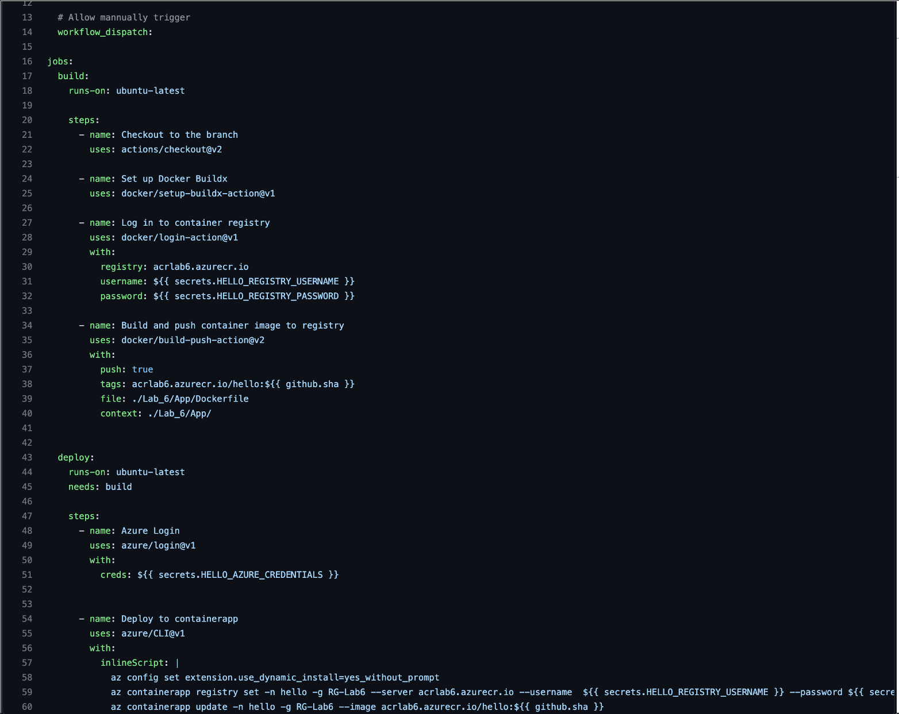<br>
Suite du Workflows(ci-dessus):<br>

- Le job "Deploy" s'exécute sur un "Runner GitHub" sur un OS Ubuntu LTS-20.04.4 (ligne 44) 
- Le job "Deploy" s'exécute une fois que le job "build" se termine sans erreur (ligne 45)
- Le job "Deploy" utilise l'action 'azure/login@v1' (https://github.com/Azure/login) (lignes 48-51)
- Le job "Deploy" utilise l'action 'azure/CLI@v1' (https://github.com/marketplace/actions/azure-cli-action) (ligne 54-60)


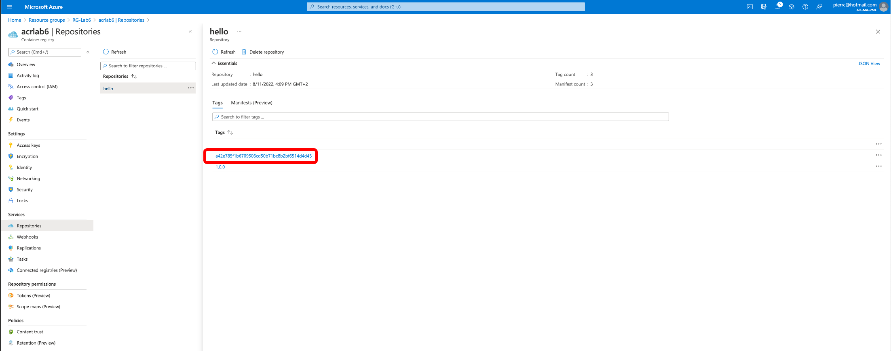<br>
Ci-dessus on voit l'image de l'application avec un tag qui correspond au SHA-1 du commit
<br><br>
<br>
En paramètrant le "Continous Deployment" l'application n'a pas été modifiée, une nouvelle révision a été créée mais avec la même version (v1)
<br><br>

**Modification de l'application**
Dans la console GitHub (ci-dessous):<br>
Allez modifier le fichier ./Lab_6/App/index.html<br>
Ligne 21 changez v1 en v2<br>
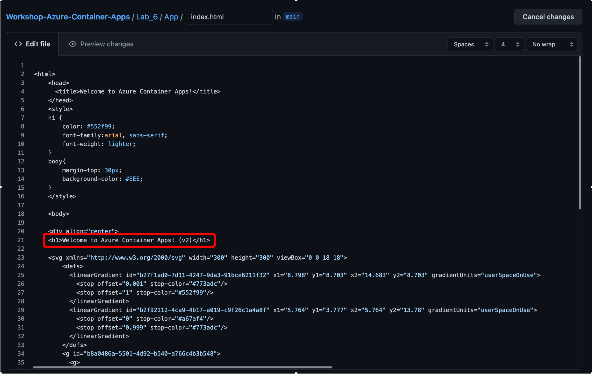<br>
Commentaire de commit, par exemple, mettre "my v2" (ci-dessous)
<br><br>
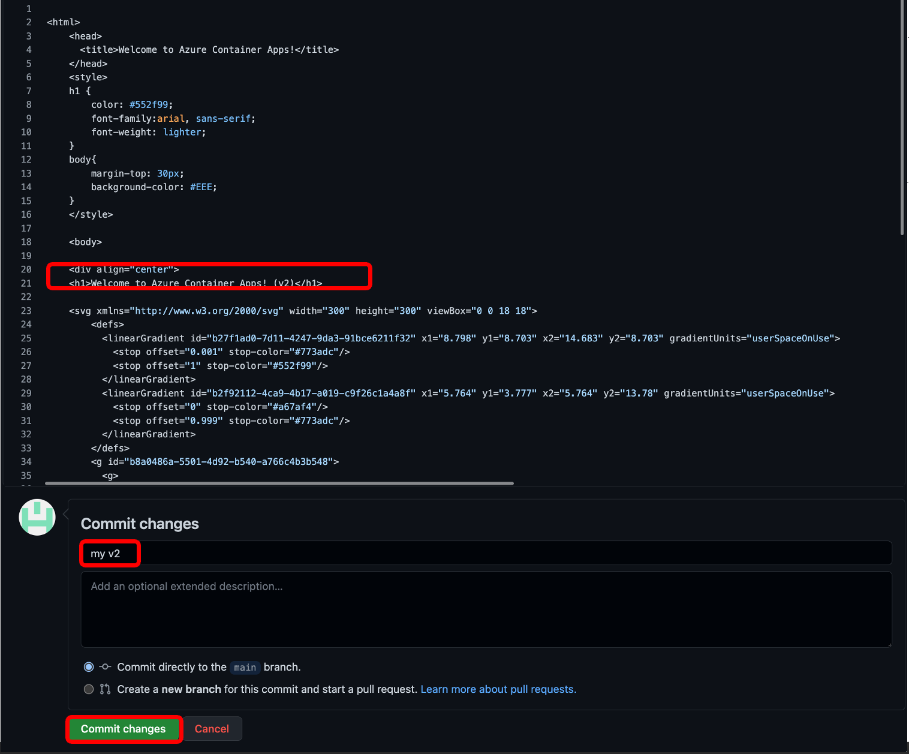<br>
<br><br>
Le workflow se déclenche automatiquement(ci-dessous)<br>
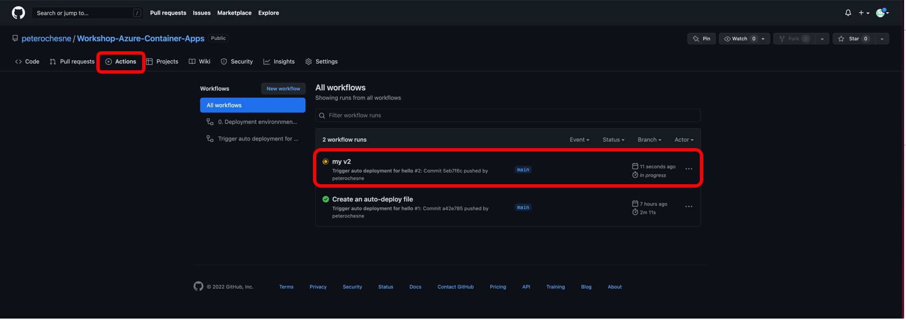<br>
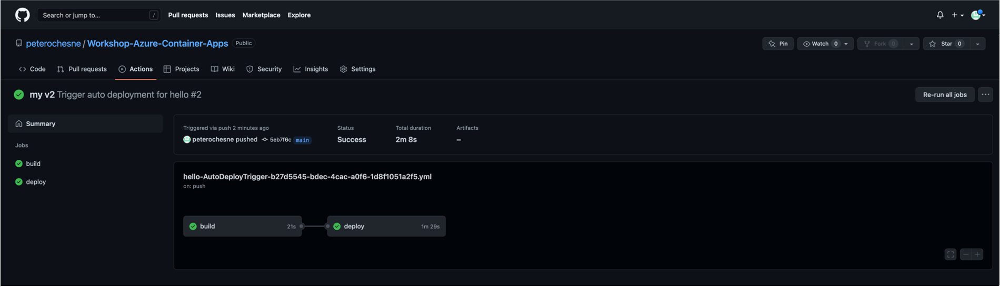<br>
Dans la console Azure (ci-dessous) :<br>

- Dans la Container App allez dans "Revision management"
- Sélectionnez "Multiple Several revisions active simultaneously"
- Save et Refresh (plusieurs fois ...)

On peut apercevoir trois révisions :

- une révision du premier déploiement (la v1 de l'application)
- une révision du déploiement lors du paramétrage du "Continous deployment" (la v1 de l'application)
- une révision avec le changement de la version de l'application


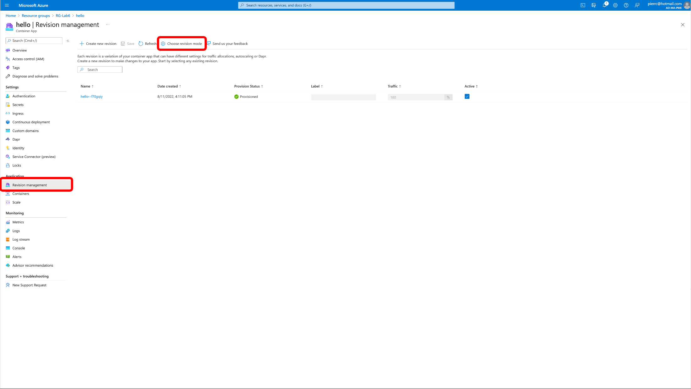<br>
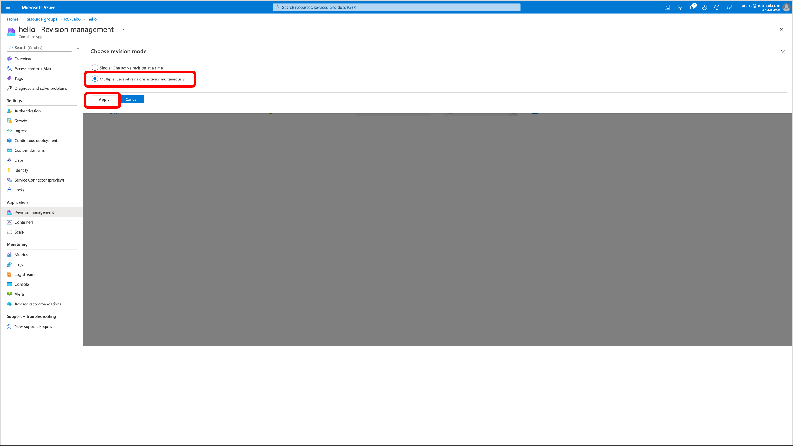<br>
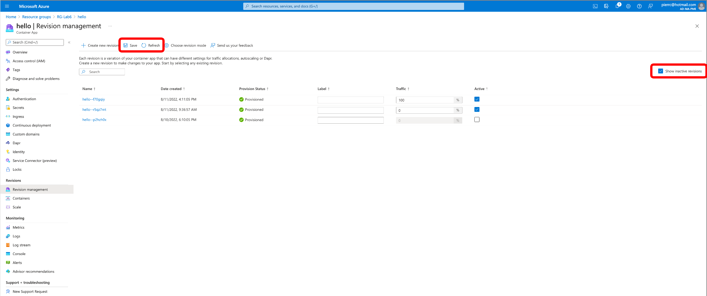<br>
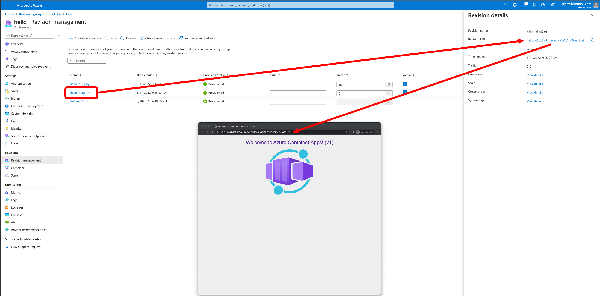<br>
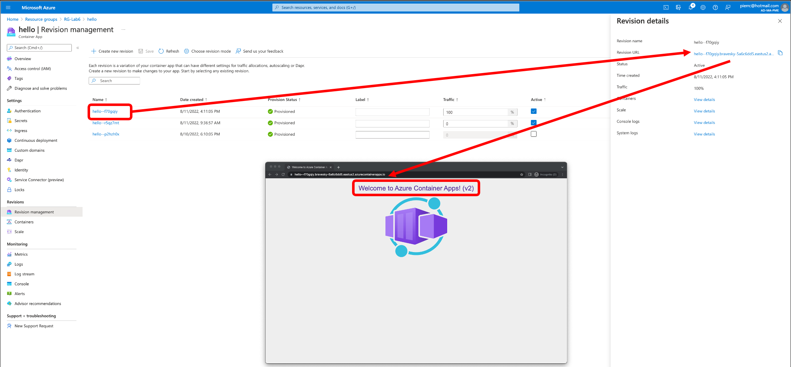<br>
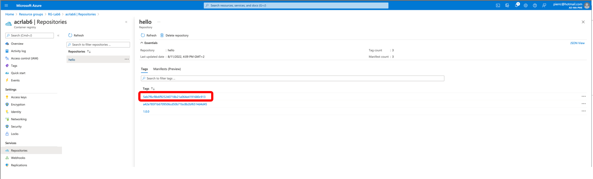<br>
Pour finir on peut apercevoir une nouvelle image qui a été générée

## Fin du Lab


