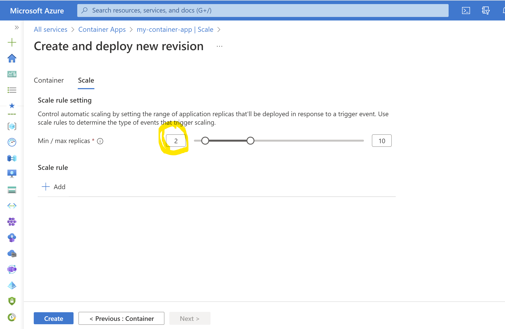
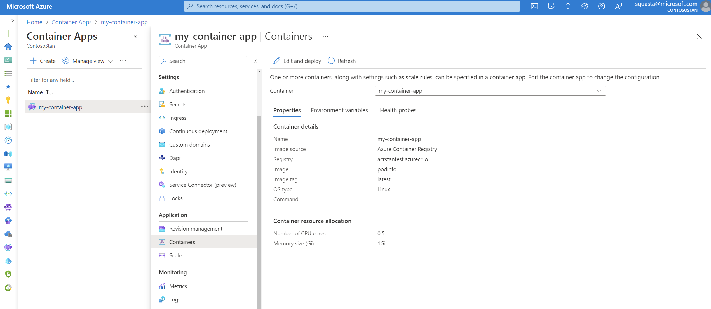
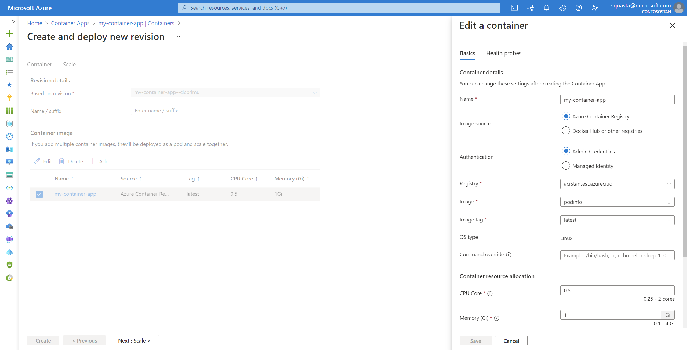
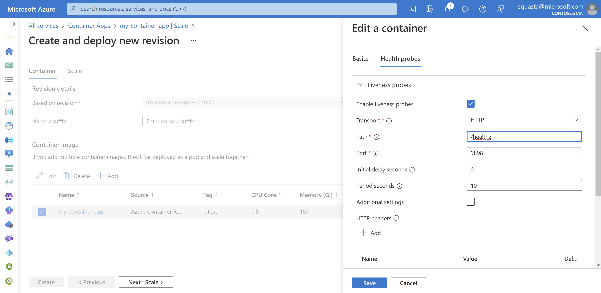
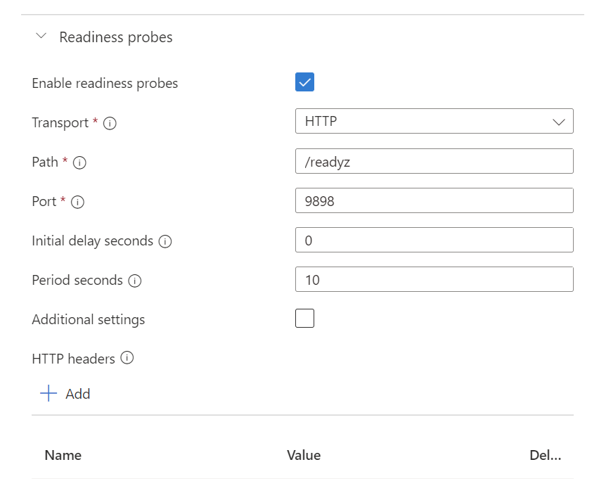
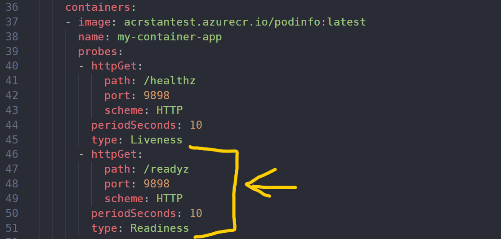

# Lab_7 Utilisation avancée Azure Container Apps avec export YAML et modification YAML

tags: #azure #azurecontainerapps #azurecli #cli #yaml #kubernetes #probes 

## Objectif:
L'objectif de ce Lab 7, c'est de déployer une Container App via Azure CLI et de modifier ses propriétés via l'export, la modification et l'import de fichiers YAML ("façon Kubernetes")


## Pré-requis sur le poste d'administration
- Un abonnement Azure avec les privilèges d'administration (idéalement owner)
- Un environnement Shell sous Bash
- Azure CLI 2.37 or >: [https://docs.microsoft.com/en-us/cli/azure/install-azure-cli?view=azure-cli-latest](https://docs.microsoft.com/en-us/cli/azure/install-azure-cli?view=azure-cli-latest) 

Les opérations sont réalisables depuis l'Azure Cloud Shell (Bash Shell) : https://shell.azure.com 

## Préparation de l'environnement de déploiement des conteneurs

Aller dans le répertoire du Lab7

Se connecter à l'abonnement Azure

```bash
az login
az account list -o table

az extension add --name containerapp --upgrade
```


### Affectation des variables

```bash
RESOURCE_GROUP="RG-Lab7"
LOCATION="eastus2"
CONTAINERAPPS_ENVIRONMENT="my-environment"
LOG_ANALYTICS_NAME="stan-workspace-lab"
ACR_NAME="acrstantest"
CONTAINER_APP_NAME="my-container-app"
```

### Création d'un ressource group

```bash
az group create \
  --name $RESOURCE_GROUP \
  --location $LOCATION -o table
```

### Création d'un Log Analytics Workspace

Créer un Log Analytics Workspace qui sera utilisé pour les logs et métriques d'Azure Container Apps

```bash
az monitor log-analytics workspace create \
 --resource-group $RESOURCE_GROUP \
 --workspace-name $LOG_ANALYTICS_NAME \
 --location $LOCATION \
 -o jsonc

LOG_ANALYTICS_WORKSPACE_CLIENT_ID=`az monitor log-analytics workspace show --query customerId -g $RESOURCE_GROUP -n $LOG_ANALYTICS_NAME --out tsv`

LOG_ANALYTICS_WORKSPACE_PRIMARY_KEY=`az monitor log-analytics workspace get-shared-keys --query primarySharedKey -g $RESOURCE_GROUP -n $LOG_ANALYTICS_NAME --out tsv`
```

## Création d'un nouvel environnement Container Apps 

Un environnement dans Azure Container Apps défini la frontière de sécurité autour d'un groupe d'applications en conteneurs.

Les applications déployées dans le même environnement se partagent un même VNet et écrivent dans le même Log Analytics Workspace.

```bash
az containerapp env create \
  --name $CONTAINERAPPS_ENVIRONMENT \
  --resource-group $RESOURCE_GROUP \
  --location $LOCATION \
  --logs-workspace-id $LOG_ANALYTICS_WORKSPACE_CLIENT_ID \
  --logs-workspace-key $LOG_ANALYTICS_WORKSPACE_PRIMARY_KEY \
  -o jsonc
```

## Création d'une Azure Container Registry

```bash
az acr create --name $ACR_NAME --resource-group $RESOURCE_GROUP --sku Basic --location $LOCATION --admin-enabled true -o jsonc
```

Récupération du mot de passe de l'admin de l'ACR

```bash
REGISTRY_PASSWORD=`az acr credential show -n $ACR_NAME -o tsv --query 'passwords[0].value'`
```

## Importation d'une image de conteneur (podinfo) dans l'ACR

**podinfo** est une petite application web écrite en Golang qui permet de démontrer les bonnes pratiques d'exécution de microservices dans Kubernetes.

Informations complémentaire sur podinfo :
- https://github.com/stefanprodan/podinfo
- https://golang-ch.cdn.ampproject.org/c/s/golang.ch/a-tiny-web-application-golang-showcases-best-practices-of-running-microservices-in-kubernetes/?amp=1
- Image dans le Docker Hub : https://hub.docker.com/r/stefanprodan/podinfo#!

```bash
az acr import \
  --name $ACR_NAME \
  --source docker.io/stefanprodan/podinfo:latest \
  --image podinfo:latest
```

## Déploiement de l'application podinfo dans Azure Container Apps

```bash
az containerapp create \
  --name $CONTAINER_APP_NAME \
  --resource-group $RESOURCE_GROUP \
  --environment $CONTAINERAPPS_ENVIRONMENT \
  --image $ACR_NAME.azurecr.io/podinfo:latest \
  --registry-server $ACR_NAME.azurecr.io \
  --registry-username $ACR_NAME \
  --registry-password $REGISTRY_PASSWORD \
  --target-port 9898 \
  --ingress 'external' \
  --query properties.configuration.ingress.fqdn \
  -o jsonc
```

## Génération du YAML et paramétrage avancé

```bash
az containerapp show \
  --name $CONTAINER_APP_NAME \
  --resource-group $RESOURCE_GROUP \
  --output yaml > app.yaml
```

Ouvrir le fichier app.yaml avec un éditeur de code
Modifier le fichier app.yaml en ajoutant une ligne sur la ligne 44 :

```bash
minReplicas: 2
```

Le nombre minimum de replicas va donc passer de 0 à 2.
Sauvegarder la modification.

Note : ces modifications peuvent être faites directement via la cli az containerapps. Ici c'est juste pour illustrer simplement le concept d'utilisation du YAML
```bash
--min-replicas 2 \
--max-replicas 5 \
```

Note: les spécifications YAML d'Azure Container Apps sont très mal (pas) documentées. cf. https://github.com/microsoft/azure-container-apps/issues/15

## Application des modifications faites dans le fichier YAML

```bash
az containerapp update \
  --name $CONTAINER_APP_NAME \
  --resource-group $RESOURCE_GROUP \
  --yaml app.yaml \
  -o jsonc
```

Vérification de la configuration

<br>

## Ajout de Heath probes 

Les health probes sont utiles à Azure Container Apps pour être certain que les instances de conteneurs démarrées sont prêtes à accepter des requêtes.

Les health probes utilisent TCP ou HTTP(s).

Ces health probes (Liveness, Readiness, Startup) sont basées sur les health probes de Kubernetes.

Par défaut Azure Container Apps n'a pas de probes configurés. Si votre application met un certain temps  à démarrer (ce qui est très commun avec Java par exemple), il est fortement recommandé de configurer des health probes pour que les conteneurs ne crashent pas.

Informations complémentaires :
- https://learn.microsoft.com/en-us/azure/container-apps/health-probes?tabs=arm-template
- https://kubernetes.io/docs/tasks/configure-pod-container/configure-liveness-readiness-startup-probes/
- https://www.thorsten-hans.com/custom-health-probes-with-azure-container-apps/

Ajout d'un liveness probe via le portail Azure :
Aller dans la Container App --> Application --> Containers/

<br>

Cliquer sur **Edit and Deploy**

Dans Container image, cliquer sur my-container-app

<br>

Puis dans le panneau de droite, cliquer sur Health probes.

Définir un liveness probe

<br>

Puis cliquer sur Save.

Exécuter la commande suivante pour voir la modification effectuée dans le fichier yaml (lignes 39 à 45).

```yaml
      probes:
      - httpGet:
          path: /healthz
          port: 9898
          scheme: HTTP
        periodSeconds: 10
        type: Liveness
```

Le Readiness Probe se configure pour cette application avec les paramètres suivants :

<br>

Ce qui correspond dans le YAML :

<br>

Détail des options de az containerapp update
https://learn.microsoft.com/en-us/cli/azure/containerapp?view=azure-cli-latest#az-containerapp-up

## Fin du Lab 7

Supprimer le resource group "RG-Lab7"

```bash
az group delete -n "RG-Lab7" -o jsonc
```


## Informations complémentaires

https://learn.microsoft.com/en-us/azure/container-apps/get-started-existing-container-image?tabs=bash&pivots=container-apps-private-registry
