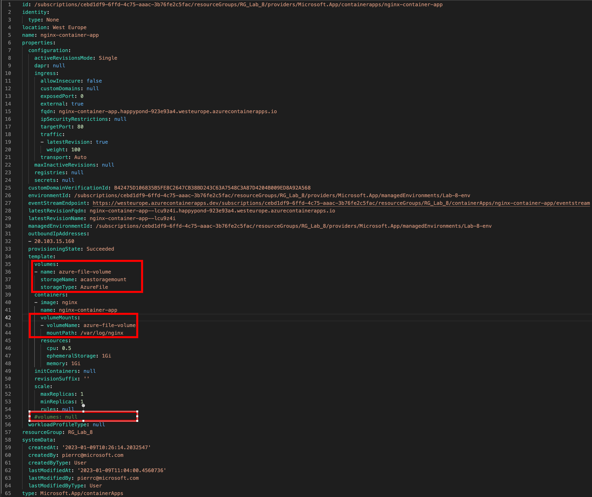
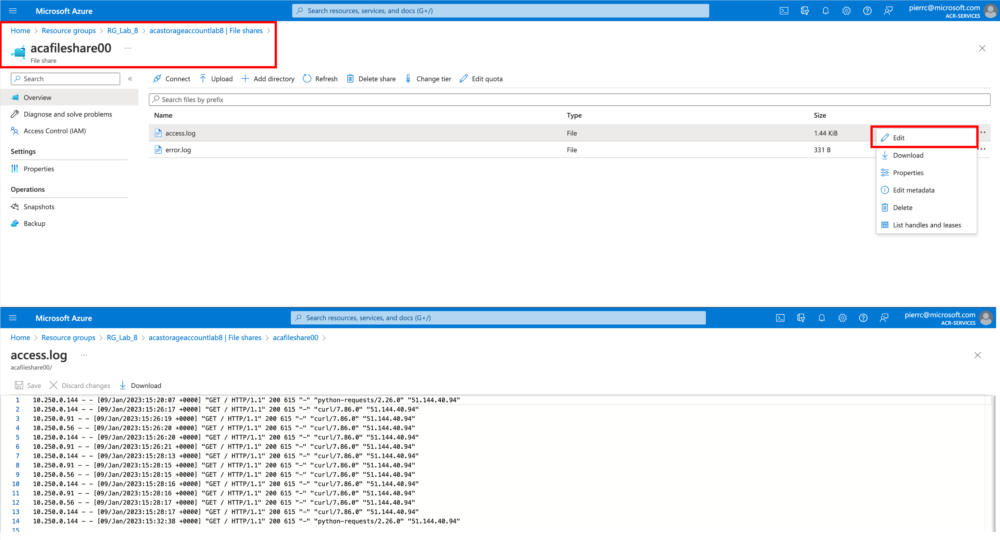

# Lab_8: Utilisation de stockage persistant
<br>
## Objectif:
Les applications qui s’exécutent dans "Azure Container Apps" peuvent avoir besoin de stocker et de récupérer des données. Bien que certaines charges de travail d’applications puissent utiliser un stockage local et rapide sur des nœuds, d’autres nécessitent un stockage persistant sur des volumes de données au sein de la plateforme Azure.<br>
L'objectif de ce Lab 8, c'est de déployer une Container Apps avec un point de montage SMB avec "Azure Files storage"

#### Etapes:<br>
- Création d'un "resource group"
- Création d'un "environmment"
- Création d'un "storage account"
- Création d'un "Azure Files Share"
- Création d'un point de montage SMB
- modification et importation du fichier YAML de configuration<br><br>
Pour cet exercice voici les variables:<br>
```
RESOURCE_GROUP="RG_Lab_8"
ENVIRONMENT_NAME="Lab-8-env"
LOCATION="westeurope"
STORAGE_ACCOUNT_NAME="acastorageaccountlab8"
STORAGE_SHARE_NAME="acafileshare00"
STORAGE_MOUNT_NAME="acastoragemount"
CONTAINER_APP_NAME="nginx-container-app"
```
Création du "Resource Group"<br>
```
az group create \
  --name $RESOURCE_GROUP \
  --location $LOCATION
```
test -> Création du "Resource Group":
```
az group show --resource-group $RESOURCE_GROUP -o table
```
Création de l'environnement "Azure Container App"<br>
```
az containerapp env create \
  --name $ENVIRONMENT_NAME \
  --resource-group $RESOURCE_GROUP \
  --logs-destination none \
  --location $LOCATION
```
test -> Création de l'environnement "Azure Container App":
```
az containerapp env show --resource-group $RESOURCE_GROUP --name $ENVIRONMENT_NAME -o table
```
Création du "storage account"<br>
```
az storage account create \
  --resource-group $RESOURCE_GROUP \
  --name $STORAGE_ACCOUNT_NAME \
  --location $LOCATION \
  --kind StorageV2 \
  --sku Standard_LRS \
  --enable-large-file-share
```
test -> Création du "storage account":
```
az storage account show --name $STORAGE_ACCOUNT_NAME -o table
``` 
Création du "File Share"<br>
```
az storage share-rm create \
  --resource-group $RESOURCE_GROUP \
  --storage-account $STORAGE_ACCOUNT_NAME \
  --name $STORAGE_SHARE_NAME \
  --quota 1024 \
  --enabled-protocols SMB
```
test -> Création du "File Share"
```
az storage share-rm show --name $STORAGE_SHARE_NAME --storage-account $STORAGE_ACCOUNT_NAME -o table
```

Récupération de la première "Access Key"<br>
```
STORAGE_ACCOUNT_KEY=`az storage account keys list -n $STORAGE_ACCOUNT_NAME --query "[0].value" -o tsv`
```
test -> Récupération de la première "Access Key"
```
echo $STORAGE_ACCOUNT_KEY
```
Création du point de montage SMB<br>
```
az containerapp env storage set \
  --access-mode ReadWrite \
  --azure-file-account-name $STORAGE_ACCOUNT_NAME \
  --azure-file-account-key $STORAGE_ACCOUNT_KEY \
  --azure-file-share-name $STORAGE_SHARE_NAME \
  --storage-name $STORAGE_MOUNT_NAME \
  --name $ENVIRONMENT_NAME \
  --resource-group $RESOURCE_GROUP
 ```
test -> Création du point de montage SMB:
```
az containerapp env storage show --resource-group $RESOURCE_GROUP --storage-name $STORAGE_MOUNT_NAME --name $ENVIRONMENT_NAME -o table
```
Création de l' "Azure Container App"<br>
```
az containerapp create \
  --name $CONTAINER_APP_NAME \
  --resource-group $RESOURCE_GROUP \
  --environment $ENVIRONMENT_NAME \
  --image nginx \
  --min-replicas 1 \
  --max-replicas 1 \
  --target-port 80 \
  --ingress external \
  --query properties.configuration.ingress.fqdn
```
test -> Création de l' "Azure Container App"
```
curl de l'output
ex: curl https://nginx-container-app.happypond-923e93a4.westeurope.azurecontainerapps.io/
```
Export du fichier de YAML de configuration<br>
```
az containerapp show \
  --name $CONTAINER_APP_NAME \
  --resource-group $RESOURCE_GROUP \
  --output yaml > app.yaml
```
Editez le fichier app.yaml (nano, vi, code, ....)<br>
Ajoutez une référence aux volumes de stockage à la définition du modèle.<br>
```
template:
  volumes:
  - name: azure-file-volume
    storageName: acastoragemount
    storageType: AzureFile
```
Ajouter une section volumeMounts au conteneur nginx dans la section containers<br>
```
containers:
  - image: nginx
    name: nginx-container-app
    volumeMounts:
    - volumeName: azure-file-volume
      mountPath: /var/log/nginx
```
le fichier doit resssembler à cet exemple ci-dessous: <br>
<br>
Appliquez le fichier YAML de configuration
```
az containerapp update \
  --name $CONTAINER_APP_NAME \
  --resource-group $RESOURCE_GROUP \
  --yaml app.yaml \
  --output table
```
Vérification et tests <br>
Test -> Azure Container App<br>
```
curl de l'output
ex: curl https://nginx-container-app.happypond-923e93a4.westeurope.azurecontainerapps.io/
```
Connexion au conteneur<br>
```
az containerapp exec --name $CONTAINER_APP_NAME --resource-group $RESOURCE_GROUP
```
Une fois connecté au conteneur<br>
```
cd /var/log/nginx
```
```
ls
access.log  error.log
```
```
cat access.log
10.250.0.144 - - [09/Jan/2023:15:20:07 +0000] "GET / HTTP/1.1" 200 615 "-" "python-requests/2.26.0" "51.144.40.94"
10.250.0.144 - - [09/Jan/2023:15:26:17 +0000] "GET / HTTP/1.1" 200 615 "-" "curl/7.86.0" "51.144.40.94"
10.250.0.91 - - [09/Jan/2023:15:26:19 +0000] "GET / HTTP/1.1" 200 615 "-" "curl/7.86.0" "51.144.40.94"
10.250.0.56 - - [09/Jan/2023:15:26:20 +0000] "GET / HTTP/1.1" 200 615 "-" "curl/7.86.0" "51.144.40.94"
10.250.0.144 - - [09/Jan/2023:15:26:20 +0000] "GET / HTTP/1.1" 200 615 "-" "curl/7.86.0" "51.144.40.94"
10.250.0.91 - - [09/Jan/2023:15:26:21 +0000] "GET / HTTP/1.1" 200 615 "-" "curl/7.86.0" "51.144.40.94"
10.250.0.144 - - [09/Jan/2023:15:28:13 +0000] "GET / HTTP/1.1" 200 615 "-" "curl/7.86.0" "51.144.40.94"
10.250.0.91 - - [09/Jan/2023:15:28:15 +0000] "GET / HTTP/1.1" 200 615 "-" "curl/7.86.0" "51.144.40.94"
10.250.0.56 - - [09/Jan/2023:15:28:15 +0000] "GET / HTTP/1.1" 200 615 "-" "curl/7.86.0" "51.144.40.94"
10.250.0.144 - - [09/Jan/2023:15:28:16 +0000] "GET / HTTP/1.1" 200 615 "-" "curl/7.86.0" "51.144.40.94"
10.250.0.91 - - [09/Jan/2023:15:28:16 +0000] "GET / HTTP/1.1" 200 615 "-" "curl/7.86.0" "51.144.40.94"
10.250.0.56 - - [09/Jan/2023:15:28:17 +0000] "GET / HTTP/1.1" 200 615 "-" "curl/7.86.0" "51.144.40.94"
10.250.0.144 - - [09/Jan/2023:15:28:17 +0000] "GET / HTTP/1.1" 200 615 "-" "curl/7.86.0" "51.144.40.94"
10.250.0.144 - - [09/Jan/2023:15:32:38 +0000] "GET / HTTP/1.1" 200 615 "-" "python-requests/2.26.0" "51.144.40.94"
```
Allez dans la console Azure<br>
Visualisation du point de montage (/var/log/nginx)<br>
<br>

Fin du Lab<br>
```
az group delete \
  --name $RESOURCE_GROUP \
  --yes
```


 


