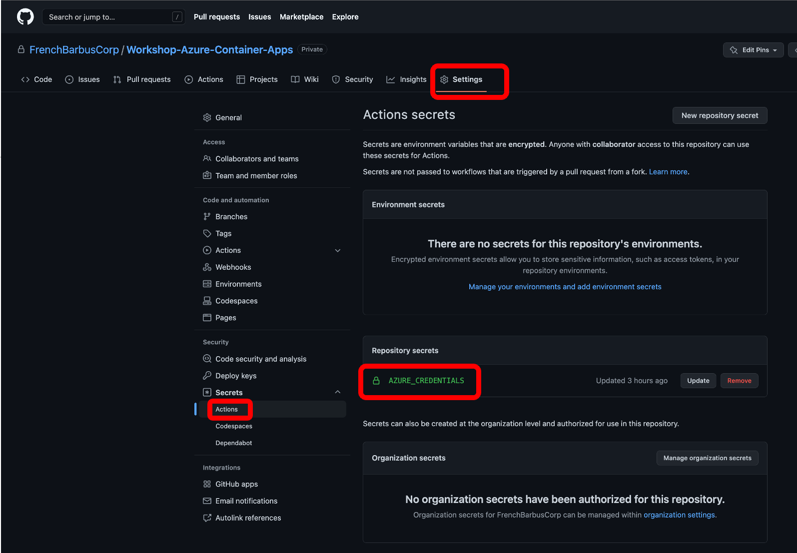
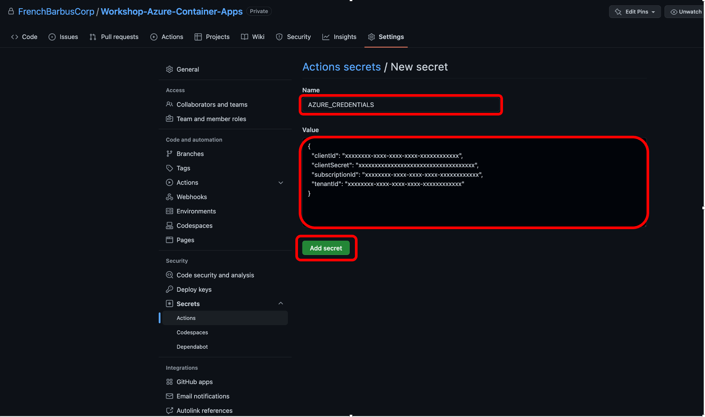
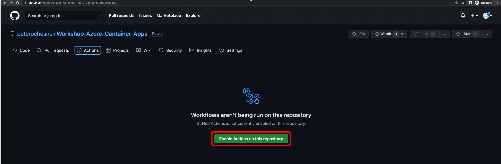
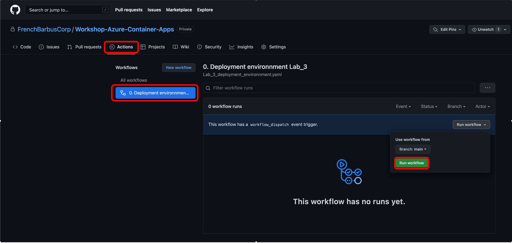
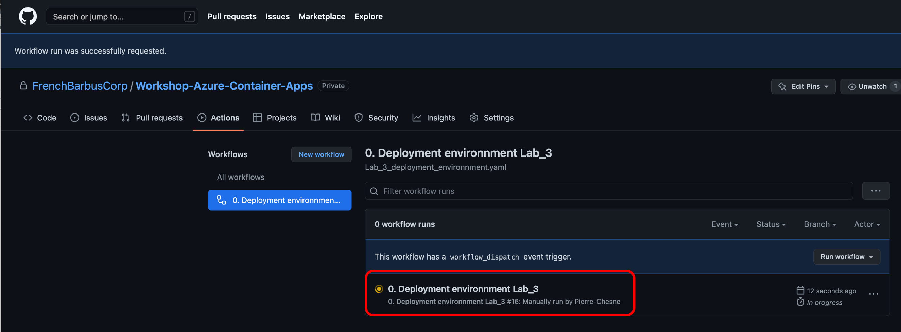
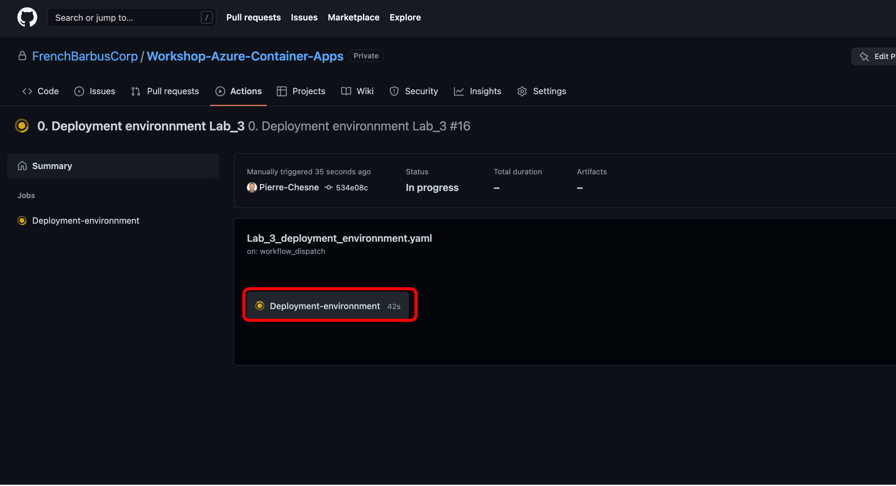
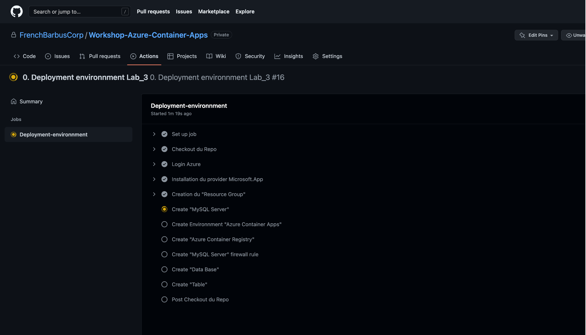
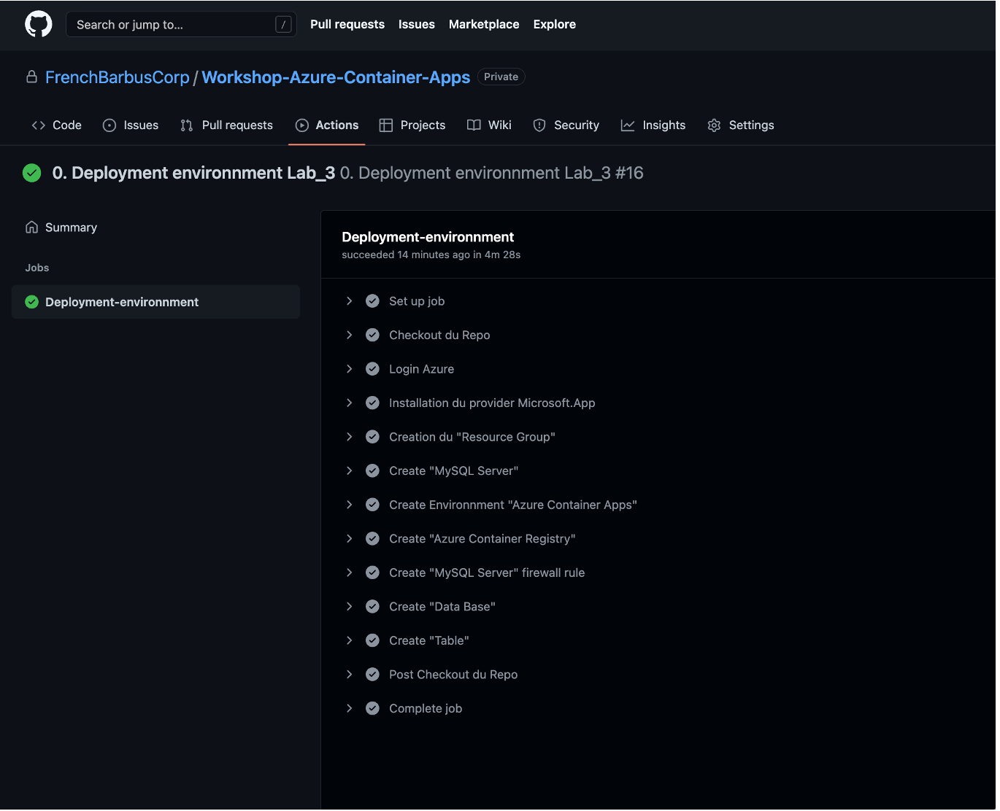

# Lab_9: Pipeline "revision"

## Objectif:
L'objectif de ce Lab 9, c'est de gérer les révisions d'une Application(Azure Container App) avec un "Workflow GitHub Action" en s'appuyant sur une "action Azure/aca-review-apps@v0.2.0"<br><br>

Prérequis pour GitHub<br>
On répucère les informations du "Service Principal" (lab 3)<br>
```
{
  "clientId": "xxxxxxxx-xxxx-xxxx-xxxx-xxxxxxxxxxxx",
  "clientSecret": "xxxxxxxxxxxxxxxxxxxxxxxxxxxxxxxxxxxx",
  "subscriptionId": "xxxxxxxx-xxxx-xxxx-xxxx-xxxxxxxxxxxx",
  "tenantId": "xxxxxxxx-xxxx-xxxx-xxxx-xxxxxxxxxxxx"
}
```
Dans GitHub, allez dans le service secret:
<br>
Dans le service secret, créez un secret "AZURE_CREDENTIALS"<br>
Et mettez le "Service Principal" comme ci-dessous:<br>
<br>


Variables 
```
RESOURCE_GROUP="RG_Lab_9"
LOCATION="westeurope"
ACR_NAME="acrlab9"
ENVIRONMENT_NAME="Lab-9-env"
APPLICATION="hello-aca"
VERSION_1_APPLICATION=1.0.0
REVISION_01=rev-01
VERSION_2_APPLICATION=2.0.0
REVISION_02=rev-02
```
Création du "Resource Group"<br>
```
az group create \
  --name $RESOURCE_GROUP \
  --location $LOCATION
```
test -> Création du "Resource Group":
```
az group show --resource-group $RESOURCE_GROUP -o table
```
Création d'Azure Container Registry
```
az acr create \
  --resource-group $RESOURCE_GROUP \
  --name $ACR_NAME \
  --sku Basic \
  --admin-enabled true
```
test ->  Création d'Azure Container Registry
```
az acr show --name $ACR_NAME --resource-group $RESOURCE_GROUP -o table
```
Création de "Container Apps environment":<br>
```
az containerapp env create \
  --name $ENVIRONMENT_NAME \
  --resource-group $RESOURCE_GROUP \
  --location $LOCATION \
  --logs-destination none
```
test -> Visualisation de "Container Apps environment"
```
az containerapp env list --resource-group $RESOURCE_GROUP -o jsonc
```

Build & Push Application
```
cd ./Lab_9/App
az acr build -t $ACR_NAME.azurecr.io/$APPLICATION:$VERSION_1_APPLICATION -r $ACR_NAME .
```
test -> Build & Push Application
```
az acr repository list --name $ACR_NAME -o table
```
```
Result
---------
hello-aca
```
Deploiement de l'application "hello-aca"
```
REGISTRY_PASSWORD=$(az acr credential show --name $ACR_NAME -o tsv --query "passwords[0].value")

az containerapp create \
  --name $APPLICATION \
  --resource-group $RESOURCE_GROUP \
  --environment $ENVIRONMENT_NAME \
  --image $ACR_NAME.azurecr.io/$APPLICATION:$VERSION_1_APPLICATION \
  --revision-suffix $REVISION_01 \
  --registry-server $ACR_NAME.azurecr.io \
  --registry-username $ACR_NAME \
  --registry-password $REGISTRY_PASSWORD \
  --target-port 3000 \
  --ingress 'external' \
  --query properties.configuration.ingress.fqdn \
  -o jsonc
```
Test de l'application<br>
Ouvrir un navigateur et allez sur l'URL de l'output de l'app "hello-aca", vous devez avoir :<br>
```
Welcome to Azure Container Apps! (v1)
```
Modification de l'App

Dans le fichier ./App/index.html -> ligne 21<br>
Modifiez v1 en v2
```
Welcome to Azure Container Apps! (v1)
en
Welcome to Azure Container Apps! (v2)
```
Build & Push de la nouvelle version de l'application

```
az acr build -t $ACR_NAME.azurecr.io/$APPLICATION:$VERSION_2_APPLICATION -r $ACR_NAME .
```
Test -> Build & Push de la nouvelle version de l'application
```
az acr repository show-tags --name $ACR_NAME --repository $APPLICATION  --orderby time_desc --output table
```
```
Result
--------
2.0.0
1.0.0
```

Déploiement d'une nouvelle révision (V2)
Allez dans le Workflow `./github/workflows/Lab9_revision.yml`<br>
Modifiez le workflows avec votre environnement<br>
Déclenchez le Workflows manuellement<br>
Pour déclancher le workflow:<br>
<br>
<br>
Pour suivre l'exécution du workflows:<br>
<br>
<br>
<br>
<br>
<br>
<br>
<br>
Test -> du déploiement de la nouvelle révision
```
az containerapp ingress traffic show --name $APPLICATION --resource-group $RESOURCE_GROUP -o table
```
```
RevisionName       Weight
-----------------  --------
hello-aca--rev-01  100
hello-aca--rev-02  0
```
Pour la redirection du trafic vers la revision "rev-02"<br>
```
az containerapp ingress traffic set \
  --name $APPLICATION \
  --resource-group $RESOURCE_GROUP \
  --revision-weight $APPLICATION--$REVISION_01=0 $APPLICATION--$REVISION_02=100
```
Test -> Pour la redirection du trafic vers la revision "rev-02"
```
az containerapp ingress traffic show --name $APPLICATION --resource-group $RESOURCE_GROUP -o table
```
```
RevisionName       Weight
-----------------  --------
hello-aca--rev-01  0
hello-aca--rev-02  100
```
Test de la nouvelle révision
```
URL=`(az containerapp show \
  --name $APPLICATION \
  --resource-group $RESOURCE_GROUP \
  --query properties.configuration.ingress.fqdn -o tsv)`
curl https://$URL
```
Checkez la modification
```
Welcome to Azure Container Apps! (v2)
```
fin du Lab
```
az group delete --name $RESOURCE_GROUP --yes
```
